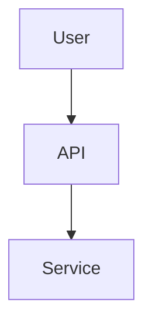

# CLAUDE.md

This file provides guidance to Claude Code (claude.ai/code) when working with code in this repository.

## Project Overview

This is a Docusaurus-based documentation site for the Kamiwaza AI platform. The repository contains both main platform documentation and SDK documentation, with versioning support and automated SDK documentation synchronization.

**Production URL**: https://docs.kamiwaza.ai

## Prerequisites

- Node.js 18.0 or higher
- npm

## Essential Commands

### Development
```bash
# Start development server (from repo root - recommended)
npm run start
# Opens http://localhost:3000 with live reload

# Start development server (from docs/ directory)
cd docs && npm run start
```

### Build and Type Checking
```bash
# Full build with SDK sync (from repo root - recommended)
npm run build

# Build only docs (from docs/ directory, skips SDK sync)
cd docs && npm run build

# Type checking
npm run typecheck

# Clear Docusaurus cache (from docs/ directory)
cd docs && npm run clear

# Preview production build locally
npm run serve
```

### Versioning

**Option A - Create new version (for releases)**
```bash
# From repo root only
npm run version-up -- <version-number>
# Example: npm run version-up -- 0.6.0
```

**Option B - Update existing version (for fixes)**
```bash
# From docs/ directory
export DOCS_VERSION=0.5.1
rm -rf versioned_docs/version-$DOCS_VERSION versioned_sidebars/version-$DOCS_VERSION-sidebars.json
node -e "const fs=require('fs');const p='versions.json';const v=JSON.parse(fs.readFileSync(p));fs.writeFileSync(p, JSON.stringify(v.filter(x=>x!=='$DOCS_VERSION'), null, 2)+'\n');"
npm run clear
npm run docusaurus -- docs:version $DOCS_VERSION
npm run build
```

### Deployment
**Deployment is automatic** via GitHub Actions when merging to `main`. No manual deployment needed.

Manual deployment (only for special circumstances):
```bash
# Linux/macOS
GIT_USER=<username> npm run deploy

# Windows
set GIT_USER=<username> && npm run deploy
```

## Repository Architecture

### Directory Structure
- **Root level**: Contains main `package.json`, scripts, and configuration
- **`docs/`**: Contains the Docusaurus site with its own `package.json` and dependencies
- **`docs/docs/`**: Main platform documentation content
- **`docs/sdk/`**: SDK documentation (auto-generated from external kamiwaza-sdk repo)
- **`docs/versioned_docs/`**: Archived versions of documentation
- **`scripts/`**: TypeScript automation scripts for versioning and SDK sync

### Key Scripts and Their Purpose
1. **`sync-sdk-docs.ts`**: Syncs SDK documentation from external kamiwaza-sdk repository
2. **`version-up.ts`**: Automates the complete versioning process (creates snapshots, updates configs)
3. **`version.ts`**: Helper script for version management

### Documentation Organization
The site has multiple documentation sections configured as separate Docusaurus plugin instances:
- **Main docs** (`/`): Platform documentation with versioning
- **SDK docs** (`/sdk`): API reference and service documentation
- **Blog** (`/blog`): Blog posts and announcements

### SDK Documentation Sync
The `sync-sdk-docs` script automatically pulls documentation from the kamiwaza-sdk repository. It looks for the SDK in these locations:
1. Environment variable: `KW_SDK_DOCS` or `KAMIWAZA_SDK_DOCS`
2. Sibling directory: `../kamiwaza-sdk/docs`
3. Alternate sibling: `../../kamiwaza-sdk/docs`
4. Monorepo layout: `../../kamiwaza/kamiwaza-sdk/docs`

## Development Workflow

### Standard Process

1. **Create feature branch**
   ```bash
   git checkout -b feature/your-changes
   ```

2. **Edit documentation**
   - Edit files in `docs/docs/` (platform docs) or `docs/sdk/` (SDK docs)
   - **Do not edit `versioned_docs/` directly** - always edit current docs
   - Test locally: `npm run start` (from repo root)

3. **Version the documentation** (choose one):
   - **Option A**: Create new version for releases (see Versioning section)
   - **Option B**: Update existing version for fixes (see Versioning section)

4. **Verify build after versioning**
   ```bash
   # From repo root
   npm run build

   # Check for broken links or build errors
   # Optional: Preview locally
   npm run serve
   ```

5. **Submit pull request to `main`**
   - Ensure build passes
   - Include description of changes

6. **After merge → automatic deployment**
   - GitHub Actions automatically deploys to https://docs.kamiwaza.ai
   - No manual deployment needed

### Working with Documentation

#### Adding New Pages
1. Create `.md` or `.mdx` file in `docs/docs/`
2. Add to `docs/sidebars.ts` (or `sidebars-sdk.ts` for SDK docs)
3. Test locally, then version

#### Images
- Place images in `docs/static/img/`
- Reference: ``

#### Code Examples
```python
import kamiwaza as kz
client = kz.Client()
```

#### Diagrams (Mermaid)


### Version Management
- **Current development docs**: `docs/docs/` (edit here)
- **Versioned docs**: `docs/versioned_docs/version-X.Y.Z/` (auto-generated, don't edit)
- **Versioned sidebars**: `docs/versioned_sidebars/` (auto-generated)
- **Version list**: `docs/versions.json`
- **Version labels**: Managed in `docusaurus.config.ts`

### Important Guidelines
- **Run from repo root**: Most commands should run from `kamiwaza-docs/` not `docs/`
- **Only edit current docs**: Don't edit `versioned_docs/` directly
- **Version before PR**: Create or update version snapshots before submitting
- **Search works in production only**: Use `npm run build && npm run serve` to test locally

### Common Issues
- **"Missing script: version-up"**: Run versioning commands from repo root, not docs/
- **SDK sync failures**: Check that kamiwaza-sdk repository is available in expected location
- **Build failures**: Try `npm run clear` from docs/ directory to clear cache
- **Version conflicts**: Ensure version numbers are consistent across package.json files and docusaurus.config.ts