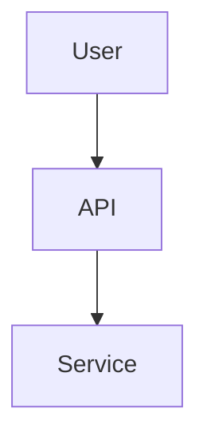

# Kamiwaza Documentation

Documentation for the Kamiwaza AI platform, built with [Docusaurus](https://docusaurus.io/).

## Quick Start

### Prerequisites
- Node.js 18.0 or higher
- npm

### Installation

```bash
# From repo root
npm install

# Install docs dependencies
cd docs
npm install
```

### Local Development

```bash
# From repo root (recommended)
npm run start

# Opens http://localhost:3000
# Changes reflect live without restart
```

## Development Workflow

### Standard Process

1. **Create feature branch**
   ```bash
   git checkout -b feature/your-changes
   ```

2. **Edit documentation**
   - Edit files in `docs/docs/` (platform docs) or `docs/sdk/` (SDK docs)
     - Do not edit `versioned_docs` directly
   - Test locally: `npm run start` (from repo root)

3. **Version the documentation** (choose one):

   **Option A - Create new version** (for releases):
   ```bash
   # From repo root
   npm run version-up -- 0.6.0
   ```

   **Option B - Update existing version** (for fixes; run from `docs/` directory):
   ```bash
   # From docs/ directory
   export DOCS_VERSION=<X.Y.Z>
   rm -rf versioned_docs/version-$DOCS_VERSION versioned_sidebars/version-$DOCS_VERSION-sidebars.json
   node -e "const fs=require('fs');const p='versions.json';const v=JSON.parse(fs.readFileSync(p));fs.writeFileSync(p, JSON.stringify(v.filter(x=>x!=='$DOCS_VERSION'), null, 2)+'\n');"
   npm run clear
   npm run docusaurus -- docs:version $DOCS_VERSION
   npm run build
   ```

4. **Verify build after versioning**
   ```bash
   # From `docs/` directory
   npm run build

   # Check for broken links or build errors
   # Optional: Preview locally
   npm run serve
   ```

5. **Submit pull request to `main`**
   - Ensure build passes
   - Include description of changes

6. **After merge → automatic deployment**
   - GitHub Actions automatically deploys to https://docs.kamiwaza.ai
   - No manual deployment needed

### Important Notes

- **Only edit files in `docs/docs/`** - Don't edit `versioned_docs/` directly
- **Version before PR** - Create or update version snapshots before submitting
- **Run from repo root** - Most commands should run from `kamiwaza-docs/` not `docs/`
- **Search works in production only** - Use `npm run build && npm run serve` to test locally

## Documentation Structure

```
docs/
├── docs/           # Current platform documentation (edit here)
├── sdk/            # SDK documentation (auto-synced)
├── blog/           # Blog posts
├── static/         # Images and static assets
├── src/            # Custom components and CSS
├── versioned_docs/ # Version snapshots (don't edit directly)
└── versioned_sidebars/ # Version sidebars (auto-generated)
```

## Commands Reference

### Development
```bash
npm run start         # Start dev server (from repo root)
npm run build         # Build with SDK sync (from repo root)
npm run serve         # Preview production build
npm run typecheck     # TypeScript validation
npm run clear         # Clear Docusaurus cache (from docs/)
```

### Versioning
```bash
# From repo root only
npm run version-up -- <version>   # Create new version (e.g., 0.6.0)
```

### PDF Generation
Generate PDF documentation for offline installations:

```bash
# Generate offline installation PDF (essential docs only)
npm run pdf:offline

# Generate complete documentation PDF
npm run pdf:full

# Generate specific profile with version
npm run pdf -- --profile full-docs --version 0.5.1

# Output location: dist/pdf/
```

**PDF Profiles:**
- **offline-install**: Installation guides, quickstart, admin guide, troubleshooting, release notes
- **full-docs**: Complete platform documentation

**Requirements:**
After adding PDF dependencies, run:
```bash
npm install
```

**Customizing PDF Output:**
Edit `pdf-config.yaml` in the repo root to:
- Create custom profiles
- Select which documents to include
- Configure PDF styling options
- Set output format and margins

### Federal Documentation

Federal-specific documentation (air-gapped deployments, GovCloud, IL levels) is **excluded by default** from builds. To include Federal docs:

```bash
# Development with Federal docs
npm run start:federal

# Production build with Federal docs
npm run build:federal

# Or set the environment variable directly
INCLUDE_FEDERAL_DOCS=true npm run start
```

**Federal docs location:** `docs/docs/federal/`

The Federal section appears in the sidebar after the Security category when enabled.

### Deployment
Deployment is **automatic** via GitHub Actions when merging to `main`.

<details>
<summary>For manual deployment (Only for special circumstances):</summary>

```bash
# Linux/macOS
GIT_USER=<username> npm run deploy

# Windows
set GIT_USER=<username> && npm run deploy
```
</details>

## Writing Documentation

### Add New Page
1. Create `.md` or `.mdx` file in `docs/docs/`
2. Add to `docs/sidebars.ts`
3. Test locally, then version

### Code Examples
```python
import kamiwaza as kz
client = kz.Client()
```

### Diagrams (Mermaid)


### Images
- Place in `docs/static/img/`
- Reference: ``


Questions? See [Docusaurus docs](https://docusaurus.io/docs) or open an issue.
