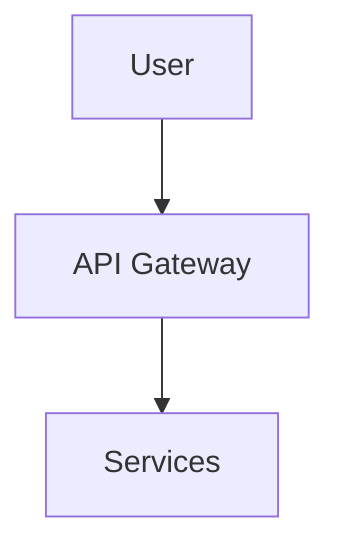

# Kamiwaza Documentation Development

This repository contains the Kamiwaza AI platform documentation built with [Docusaurus](https://docusaurus.io/). This README is for developers working on the documentation codebase.

## Development Setup

### Prerequisites
- Node.js 18.0 or higher
- npm or yarn

### Installation

Navigate to the docs directory and install dependencies:

```bash
cd docs
npm install
```

### Local Development

Start the development server:

```bash
npm run start
# or
npm run dev
```

This opens `http://localhost:3000` in your browser. Most changes are reflected live without restarting the server. Note that search functionality is disabled in development mode; see the build instructions to test it.

**Note**: Always run development commands from the `docs` directory where `docusaurus.config.ts` is located.

## Documentation Structure

- `docs/` - Main platform documentation
- `sdk/` - SDK documentation 
- `blog/` - Blog posts
- `static/` - Static assets (images, etc.)
- `src/` - Custom React components and CSS
- `versioned_docs/` - Version-specific documentation archives

## Build and Deployment

### Building with Search

To create a production build with a working search index, run:

```bash
npx docusaurus build
```

This generates all static files into the `build` directory.

### Previewing the Production Build

To preview the full site, including search functionality, serve the contents of the `build` directory:

```bash
npm run serve
```

### Deployment

Deploy to GitHub Pages:

```bash
# Using SSH
USE_SSH=true npm run deploy

# Using HTTPS
GIT_USER=<Your GitHub username> npm run deploy
```

## Version Management

The documentation uses Docusaurus versioning to maintain multiple versions of the docs.

**⚠️ Important**: Versioning commands are run from the root `kamiwaza-docs/` directory, while most other commands are run from the `docs/` subdirectory.

### Creating a New Version

To create a new version of the documentation, run the following command from the root `kamiwaza-docs` directory:

```bash
npm run version-up -- <new-version>
```

Replace `<new-version>` with the semantic version number (e.g., `0.4.0`).

**Example:**
```bash
npm run version-up -- 0.4.1
```

This command automates the entire versioning process:
- Creates a new versioned snapshot of the current docs in `versioned_docs/`.
- Updates the `versions.json` file.
- Updates the version number in both `package.json` files.
- Updates the version labels in `docusaurus.config.ts`.

After running the command, restart the development server (`npm run start` from the `docs/` directory) to see the new version reflected in the UI.

### Version Behavior

- **Current version**: Always refers to the latest development docs in `docs/`
- **Versioned releases**: Archived in `versioned_docs/version-X.Y.Z/`
- **Default display**: Current version is shown by default
- **Version switching**: Users can switch between versions via the version dropdown

### Managing Versions

List all versions:
```bash
ls versioned_docs/
cat versions.json
```

Remove a version (if needed):
1. Delete the corresponding directories in `versioned_docs/` and `versioned_sidebars/`
2. Remove the version from `versions.json`

## Content Development

### Writing Documentation

- Use Markdown with MDX support for React components
- Place images in `static/img/`
- Update `sidebars.ts` when adding new pages
- Use relative links for internal navigation

### Code Examples

Use proper syntax highlighting:

```python
# Python example
import kamiwaza as kz
client = kz.Client()
```

### Diagrams

Mermaid diagrams are supported:



## Quality Assurance

### Link Checking

Before publishing, verify all internal links work:

```bash
npm run build
```

Check the build output for broken link warnings.

### Type Checking

Run TypeScript checks:

```bash
npm run typecheck
```

## Troubleshooting

### Build Failures
- Ensure you're in the `docs` directory
- Clear the cache: `npm run clear`
- Delete `node_modules` and reinstall if needed

### Version Conflicts
- Ensure version numbers are consistent across all configuration files
- Check that version directories exist if referenced in configs

### Development Server Issues
- Check that port 3000 is available
- Try `npm run clear` to clear Docusaurus cache

### Versioning Issues
- **"Missing script: version-up"**: You're in the wrong directory. Run versioning commands from the root `kamiwaza-docs/` directory, not `docs/`
- **"No config file found"**: Docusaurus can't find its config. The `version-up` command automatically switches to the `docs/` directory where the config exists
- **"Version already exists"**: If you see errors about existing versions, check `versions.json` and remove conflicting entries, or delete the corresponding `versioned_docs/version-X.Y.Z/` folder
- **Version mismatch**: Ensure the `../kamiwaza/kamiwaza.version.json` file exists and is readable from the kamiwaza-docs directory
- **Version not showing in browser**: After running `version-up`, update version numbers in `docusaurus.config.ts` and restart the development server

## Contributing

1. Create a feature branch for documentation changes
2. Test locally with `npm run start`
3. Build successfully with `npm run build`
4. Submit a pull request with clear descriptions of changes

For questions or issues, refer to the [Docusaurus documentation](https://docusaurus.io/docs) or create an issue in this repository.
