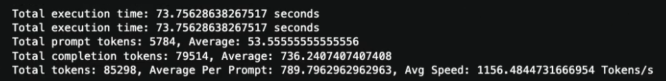

# Harnessing the Power of Large Language Models: A Hardware Primer

Welcome to an illuminating journey through the world of hardware essentials for deploying and leveraging Large Language Models (LLMs). In this era of generative AI, the right hardware is not just an operational need; it’s a strategic asset that can drastically elevate the performance, scalability, and efficiency of your AI applications. Whether you are integrating AI into your enterprise solutions or enhancing existing applications, understanding the interplay between hardware and AI capabilities is fundamental. Let's dive into the crucial hardware considerations that can help you kickstart and scale your AI initiatives effectively.

## The Right Hardware for the Right Task: Starting Your AI Journey

Before diving into specifics, it's essential to understand why selecting the right hardware is critical for proving the value of AI in your business. The hardware you choose impacts everything from development speed to operational efficiency and scalability. It serves as the launching pad for your AI projects, setting the tone for innovation and performance outcomes.

### Nvidia with Linux: The Leading Choice for AI

#### Optimal for High-Performance AI Tasks

Nvidia GPUs, running on a Linux operating system, are a common sight in the world of AI hardware, largely due to Nvidia's significant market share and proven track record in AI applications. This combination is highly scalable, perfect for server setups where expansion is anticipated, and offers robust AI support with superior CUDA support for intensive computations.

#### Considerations

- **Driver Compatibility:** Linux requires careful management of GPU drivers and CUDA versions, which can be challenging in rapidly evolving setups.

### Apple OSX with Metal: Seamless Integration for Mac Developers

#### Best for Integrated Apple Ecosystems

For developers already embedded in the Apple ecosystem, OSX with Metal provides a streamlined performance pathway. Metal API is tailored to optimize AI operations specifically on Apple hardware, leveraging shared memory capabilities and accommodating large RAM sizes which are integral for complex AI tasks.

#### Considerations

- **Limited GPU Support:** Apple hardware typically does not support external GPUs as flexibly as PC setups, limiting performance scalability.

### Windows Environments

#### Versatile but with Nuanced Support

Windows has long been a first class citizen for nVidia drivers due to its heritage in gaming. Indeed, nVidia has even release a [Chat With RTX](https://blogs.nvidia.com/blog/chat-with-rtx-available-now/) local LLM/RAG app; the problem with Windows for Enterprise is that it can be much more challenging to see the direct path between development and production due to the large OS deltas. One reason Kamiwaza opted to build and support OSX hand-in-hand with Linux as a production environment was that the support on OSX was nearly like-for-like, providing a very consistent development -> production experience.

## Understanding Model Scales: From SLM to LLM

Before discussing specific models, it's crucial to understand what a "model" in AI parlance means. Essentially, the term refers to the underlying AI that has been trained to understand and generate human-like text based on the data it has been fed. Models are measured in parameters—a parameter being a piece of the model that has learned a specific part of the data during training. The scale of the model, from Small Language Models (SLMs) like Google's Gemma-2B, to an optimized open source 7B model like [OpenHermes-2.5-Mistral-7B](https://huggingface.co/teknium/OpenHermes-2.5-Mistral-7B) for drafting emails, to Large Language Models (LLMs) like HuggingFace’s Zephyr-Orpo 141B, a fine-tuning of Mistral Mixtral-8x22B models.

### Small Language Models (SLM) & Developer Systems

**Hardware Needs:** Can run efficiently on consumer-grade laptops or desktops typically; and even, depending on the hardware, directly on consumer mobile devices. Qualcomm announced in early 2023 a working version of Stable Diffusion [on an Android phone](https://www.qualcomm.com/news/onq/2023/02/worlds-first-on-device-demonstration-of-stable-diffusion-on-android). That said, for prototyping we recommend either Macbook M* with ample RAM (the M2MAX/M3 Macbook Pros, or equivalent Mac desktops, are extremely popular with developers and other professionals, but with heavy RAM, 96-128GB, they can run extremely large models).

### Large Language Models (LLM)

For larger models, heavy production use, you typically now want to turn to production-grade hardware. While the typical choice today is Linux servers with nVidia GPUs, there are a lot of alternatives here, including:

- **CPU-based inference** on Intel AVX512-capable chips
- **Qualcomm** [AI 100](https://www.qualcomm.com/products/technology/processors/cloud-artificial-intelligence/cloud-ai-100) series, with their AI 100 Pro and AI 100 Ultra, which are extremely powerful hardware with impressively low power consumption
- **AMD** [AMD Instinct](https://www.amd.com/en/products/accelerators/instinct/mi300/mi300x.html) is AMD's answer to nVidia's dominance and sport impressively large VRAM and solid performance; but many caution around software support in newer libraries
- **nVidia** nVidia needs no introduction; their A100 and H100, with their upcoming GH200 and the recently announced [Blackwell](https://nvidianews.nvidia.com/news/nvidia-blackwell-platform-arrives-to-power-a-new-era-of-computing) GPUs starting with the B100. nVidia has reaped the boom of GenAI very notably with orgs like Meta announcing a buy of [350,000 H100s](https://www.pcmag.com/news/zuckerbergs-meta-is-spending-billions-to-buy-350000-nvidia-h100-gpus), adding to an extremely large farm of GPUs already operated - this helps them attract and retain talent developing their in-house open-sourced LLMs, like [Llama 2](https://llama.meta.com/llama2/), arguably the most influential open-source AI model ever released.

## Decoding Performance Metrics: Token Speed and VRAM

When selecting hardware for AI, understanding performance metrics is crucial. Token speed and VRAM stand out as primary indicators.

**Tokens/second** is just a metric of how fast a given model engine can generate output tokens. For a visual in-context view on model deployment and stress test, check out the [Kamiwaza Model Deployment and Inference Stress Test](https://www.youtube.com/watch?v=h4yyqfw9liY) video on YouTube.

It's important to note that due to the way the hardware and software interact, there's a difference on many hardware platforms between the speed you would see in a single client generation (e.g., one prompt -> one response) vs batched. For example, in the image above, our stress test averaged almost 1200 tokens/second but the same card responding to a single request would likely only get ~40-60 tokens/second at best; but it can perform many parallel inferences when batching. Kamiwaza helps with model deployment to make this easier to manage.

- **Model Size Impact:** Larger models, while capable of generating more complex texts, tend to operate more slowly due to their size. More **parameters** means more math operations for each pass through a model. You can think of it as a set of multiplication operations through dense matrices, each full pass popping out the next generated token based on the input context and probabilities in the neural network weights.
- **VRAM Requirements** As a rule, you can think of memory requirements being driven by three things:

1. **The number of Parameters**: For a "70B" model, 70 billion parameters means 70 billion numbers in the neural network, effectively. Model models at "full weight" for inference at 16-bit, and you may see the term *float16* or *bfloat16* which are specific 2-byte data types. So a full-weight 70B model needs 140GB of memory to hold the weights. This number can be reduced through using a lower-precision model, through a technique called **quantization** which is essentially a neural-network specific version of "rounding" the numbers; so instead of a 16-bit number, each weight becomes an 8-bit or a 4-bit weight. (And quantization has more variety than that, such as quantizing different layers to different weights, as some are more performance-sensitive to that rounding)
2. **The context**: The user input must be converted into numbers also, called an embedding, to be processed by the network; there is the direct usage of the embedding, but there is also intermediate calculations and caches; the usage of these varies by architecture.  There are some tools like this [VRAM calculator on HuggingFace](https://huggingface.co/spaces/NyxKrage/LLM-Model-VRAM-Calculator) that can help estimate; something like 1-2GB per 4096 input context tokens at a batch size of 512 isn't a terrible rule of thumb, but this varies quite a bit.
3. **Added KV Cache for Performance**: Engines like vLLM (the default deployment engine Kamiwaza deploys on when using Linux) pre-allocate additional memory for KV cache; this can dramatically speed up performance. vLLM will happily pre-allocate an entire 80GB card even on a 7B parameter model (so, one you could definitely run easily at full weight even on a 24GB consumer card), but it doesn't need that much. Kamiwaza's default deployment configs can be modified but try to allocate a recommended amount of memory by default for a performance boost, without being excessively generous.

## Advancements in Model Efficiency

In the dynamic landscape of AI, continuous improvements are crucial for enhancing model performance and managing resource utilization effectively. Key techniques have emerged that not only boost computational efficiency but also optimize the overall functioning of AI models:

- **Quantization:** This technique transforms the model to operate on lower precision (e.g., 8-bit integers instead of 16-bit floats), which can significantly increase the speed of computations and reduce the overall model size. This is particularly beneficial in environments with limited hardware capabilities or where rapid response times are crucial.
- **Mixture of Depths:** Adapting the depth of the neural network layers according to the task complexity can optimize processing time and power consumption. This approach tailors the resource allocation based on the immediate needs of the application, ensuring efficient use of computational power.
- **Dynamic Pruning:** By temporarily reducing the size of the neural network during computations, dynamic pruning helps conserve resources without a notable compromise in performance. This method is particularly useful in runtime environments where flexibility in resource allocation can lead to cost efficiencies.

These techniques represent the forefront of making large-scale models more accessible and manageable, paving the way for broader adoption across various industries.

## Comprehensive Approach to AI Application Stack

Implementing LLMs effectively requires a comprehensive understanding and integration of multiple components of the AI application stack. This holistic approach ensures that each layer is optimized for maximum performance and efficiency:

1. **Hardware:** The foundational layer, which includes high-performance GPUs and CPUs, tailored to the needs of demanding AI tasks.
2. **Operating System:** Choosing the right OS—whether it be Linux, OSX, or Windows—is crucial as it must synergize with the hardware to optimize performance and provide stability.
3. **Model Engine:** Utilizing advanced frameworks like TensorFlow or PyTorch, which are designed to leverage the underlying hardware capabilities to the fullest.
4. **Application-Level Packages:** Tools such as LangChain and dSPY provide specialized functionalities that are essential for developing sophisticated AI applications. They serve as the building blocks for creating user-centric solutions that harness the power of LLMs.

With a solid grasp of these components, organizations can navigate the complexities of AI deployment more confidently, ensuring that their AI initiatives are both scalable and robust.

## Bottom Line Recommendations

These are "inference only" recommendations; for training, there may be other considerations.

### nVidia

- At least 3 hosts for redundancy for Enterprise
- Homogenous hardware config for cpu/gpu/memory; Kamiwaza can deploy multiple models on larger cards
- **RTX4090** is often at performance parity with the datacenter A100 card for inference; they have 24GB of memory per card
-- You can find deployment options fairly standard for configs of up to 6x4090, giving 192GB of VRAM
-- Being a consumer card, the RTX4090 can typically be found at ~$2k/card, meaning the 6x setup is favorable vs a single A100 datacenter card
- **A100, H100** are the kings of the "available" datacenter-class hardware
-- You can build single hosts at up to 8x
-- They come in PCEe and SXM form factors
-- Both very widely available in cloud instances
-- 40GB and 80GB VRAM versions
-- Relatively expensive hardware (as of this writing, a single A100 80GB is still about $17,000, just for 1 card); although prices have been coming down lately
-- For the most powerful open models, 4x or more can be required. For example, the recently released Apache-licensed [Mixtral-8x22B-v0.1 model](https://huggingface.co/mistral-community/Mixtral-8x22B-v0.1) requires **~260GB** of VRAM to load the full-weight (non-quanitzied) version, plus memory for kv cache, and input context; this means this model can largely consume a **4xA100-80B** setup on its own. Commensurately, however, fine-tunes such as the [Microsoft WizardLM fine-tune](https://huggingface.co/microsoft/WizardLM-2-8x22B) are stronger than the original GPT4 model, which combined with its 64K context length makes it comparable to being able to operate a completely private GPT4-class model
-- In the middle ground, many organizations will find that base or fine-tuned version of models like [Mixtral-8x7B](https://huggingface.co/mistralai/Mixtral-8x7B-v0.1) or [DeepSeek-Coder-33B](https://huggingface.co/deepseek-ai/deepseek-coder-33b-instruct) will be appropriate; possibly at any weights from the full weight (using a single A100) to a strong 4-5 bit quantization (which can run on a single RTX4090, or locally on a well-equippted mac/macbook pro).

### Other nVidia Hardware

As a footnote, there are a number of other cards that share similar architectures; for example, the nVidia Ada architecture powers the RTX4xxx series, but also the "pro" cards, like the RTX6000, as well the L40, sport (up to) 48GB of memory. Those can be reasonable choices as well.

For the curious, the highest-end cards, like the A100 and H100, excel at 32-bit workloads, which is why classic model training happens almost exclusively on them, as they offer the mix of large memory and good performance at high precision; this is an extremely different workload than run of the mill inference.

## Cloud vs Owned and Operated

We find our customers anywhere on the spectrum of:

- Open to Cloud, but want to control the stack: fine to use cloud instances, and Kamiwaza is cloud-deployable easily; in fact, we have a fully-scripted install that is tested on Microsoft Azure for releases, against Ubuntu 22.04LTS-Server
- Cloud ok for Test-Dev: They have use cases they want running on owned/operated hardware, but they will test on cloud instances
- Owned & Operated only: The enterprise wants to keep their entire flow private on hardware and software they control, for a variety of reasons

Obviously cloud, even using spot instances, can be a good way to do some early testing on certain models or use cases without a purchase.
