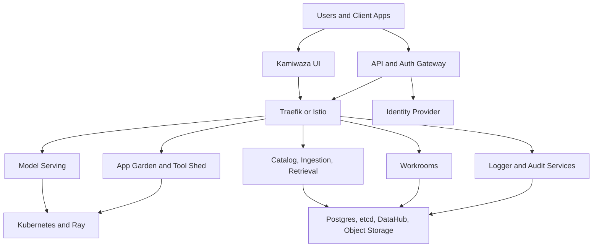

# Architecture Diagram

This diagram shows a simplified view of the current Kamiwaza platform architecture.

```mermaid
graph TD
    Users[Users and Client Apps]
    UI[Kamiwaza UI]
    API[API and Auth Gateway]
    Models[Model Serving]
    Data[Catalog, Ingestion, Retrieval]
    Gardens[App Garden and Tool Shed]
    Workrooms[Workrooms]
    Logs[Logger and Audit Services]
    Ingress[Traefik or Istio]
    IdP[Identity Provider]
    DataStores[Postgres, etcd, DataHub, Object Storage]
    Compute[Kubernetes and Ray]

    Users --> UI
    Users --> API
    UI --> Ingress
    API --> Ingress
    Ingress --> Models
    Ingress --> Data
    Ingress --> Gardens
    Ingress --> Workrooms
    Ingress --> Logs
    API --> IdP
    Models --> Compute
    Data --> DataStores
    Gardens --> Compute
    Workrooms --> DataStores
    Logs --> DataStores
```
