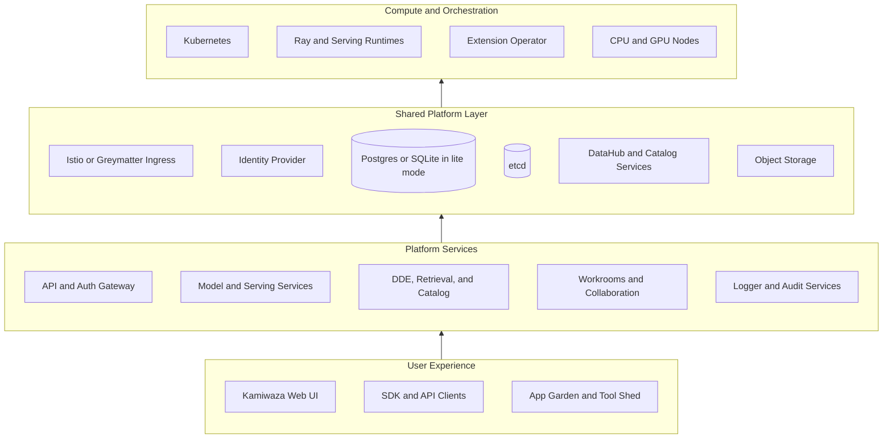

# Platform Architecture Overview

Kamiwaza is a Kubernetes-based AI platform that combines model serving, governed data access, application deployment, and security controls behind a single customer-facing domain. This page provides a high-level view of the current architecture used in supported deployments.

## System Architecture Diagram

```mermaid
flowchart BT
    subgraph Experience[User Experience]
        Frontend[Kamiwaza Web UI]
        SDK[SDK and API Clients]
        Gardens[App Garden and Tool Shed]
    end

    subgraph Services[Platform Services]
        Gateway[API and Auth Gateway]
        Models[Model and Serving Services]
        Data[DDE, Retrieval, and Catalog]
        Workrooms[Workrooms and Collaboration]
        Logger[Logger and Audit Services]
    end

    subgraph Platform[Shared Platform Layer]
        Routing[Istio or Greymatter Ingress]
        IdP[Identity Provider]
        Postgres[(Postgres or SQLite in lite mode)]
        Etcd[(etcd)]
        DataHub[DataHub and Catalog Services]
        Storage[Object Storage]
    end

    subgraph Compute[Compute and Orchestration]
        Kubernetes[Kubernetes]
        Ray[Ray and Serving Runtimes]
        Extensions[Extension Operator]
        Nodes[CPU and GPU Nodes]
    end

    Experience --> Services
    Services --> Platform
    Platform --> Compute
```

## Architecture Layers

### Experience layer

This is how users and client applications interact with Kamiwaza.

- **Kamiwaza Web UI** for administration, models, workrooms, apps, tools, and logs
- **SDK and API clients** for programmatic access
- **App Garden and Tool Shed** for launching applications and tool servers behind managed routes

### Services layer

This layer contains the platform APIs and business logic.

- **API and Auth Gateway** for authenticated access, routing, and policy enforcement
- **Model and Serving Services** for model lifecycle and inference
- **DDE, Retrieval, and Catalog** for ingestion, discovery, secret references, and retrieval flows
- **Workrooms and Collaboration** for shared workspace functionality
- **Logger and Audit Services** for runtime troubleshooting and security evidence

### Shared platform layer

This layer provides the shared services the platform depends on.

- **Istio or Greymatter** for ingress and routing, depending on environment
- **Identity provider integration** for authenticated deployments
- **Postgres** as the standard persistent database in auth-enabled deployments
- **SQLite** as a reduced-scope database option in lite mode
- **etcd** for cluster coordination and runtime configuration
- **DataHub and related catalog services** for metadata-backed catalog workflows
- **Object storage** for uploaded files, workroom context, and related assets

### Compute and orchestration layer

This layer runs the workloads that power the platform.

- **Kubernetes** as the primary deployment target
- **Ray and serving runtimes** for model execution and distributed work
- **Extension Operator** for managed application and tool deployment workflows
- **CPU and GPU nodes** that host inference and platform workloads

## Technology Stack

| Category | Technologies |
| --- | --- |
| Backend | Python, FastAPI, Ray |
| Frontend | React |
| Data and metadata | Postgres, SQLite in lite mode, etcd, DataHub |
| Routing and ingress | Istio, or Greymatter on supported external-mesh deployments |
| Deployment | Kubernetes, Helm |

## Design Principles

- **Single customer-facing domain** with path-based runtime routing as the standard deployment model
- **Security by configuration** through identity integration, access controls, consent, and auditability
- **Composable services** so model serving, retrieval, catalog, apps, and tools can evolve independently
- **Operational visibility** through deployment logs, cluster logs, and OTEL-compatible export paths
