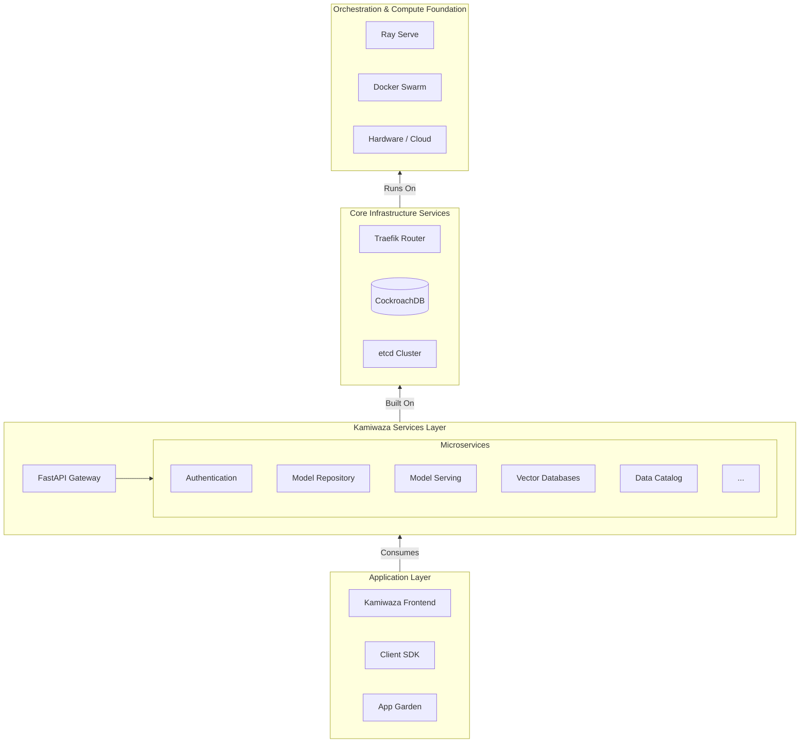

# Platform Architecture Overview

Kamiwaza is a modular, multi-layered platform designed for scalability, flexibility, and enterprise-grade performance. This document provides a high-level overview of its key architectural components and the technologies that power them.

## System Architecture Diagram

The diagram below illustrates the layered architecture of the Kamiwaza platform, from the underlying infrastructure to the user-facing applications. Each layer provides a distinct set of capabilities, creating a robust and maintainable system.

## Architecture Layers

#### 🌐 Application Layer
This is where users and developers interact with Kamiwaza.
-   **Kamiwaza Frontend**: The primary web-based user interface for managing the platform.
-   **Client SDK**: A Python SDK for programmatically interacting with Kamiwaza's APIs.
-   **App Garden**: A platform for discovering and deploying pre-packaged AI applications and services.

#### 🎯 Kamiwaza Services Layer
The core business logic of the platform, exposed via a central API gateway.
-   **FastAPI Gateway**: A high-performance API gateway that coordinates all requests.
-   **Microservices**: A suite of specialized services handling concerns like Authentication, Model Management, Vector DB abstraction (Milvus, Qdrant), and more.

#### 🛠️ Core Infrastructure Services
The essential backend services that support the entire platform.
-   **Traefik Router**: A powerful reverse proxy and load balancer that manages all inbound network traffic and provides SSL termination.
-   **CockroachDB**: The primary database—a distributed, resilient SQL database for all application data.
-   **etcd**: A distributed key-value store used for service discovery and critical configuration management across the cluster.

#### 🔧 Orchestration & Compute Foundation
The base layer that provides the compute resources and orchestration to run everything else.
-   **Ray Serve**: A scalable model-serving framework used for deploying and managing AI models.
-   **Docker Swarm**: The container orchestration engine that manages the lifecycle of all containerized services.
-   **Hardware / Cloud**: The physical servers or cloud instances (e.g., AWS, GCP, Azure) that provide the underlying CPU and GPU resources.

## Technology Stack

| Category          | Technologies                                     |
| ----------------- | ------------------------------------------------ |
| **Backend**       | Python 3.10, FastAPI, Ray, SQLAlchemy, Pydantic  |
| **Frontend**      | React 18, Material-UI, Tailwind CSS, Axios       |
| **Databases**     | CockroachDB, Milvus, Qdrant, etcd                |
| **Infrastructure**| Docker Swarm, Traefik, DataHub                   |
