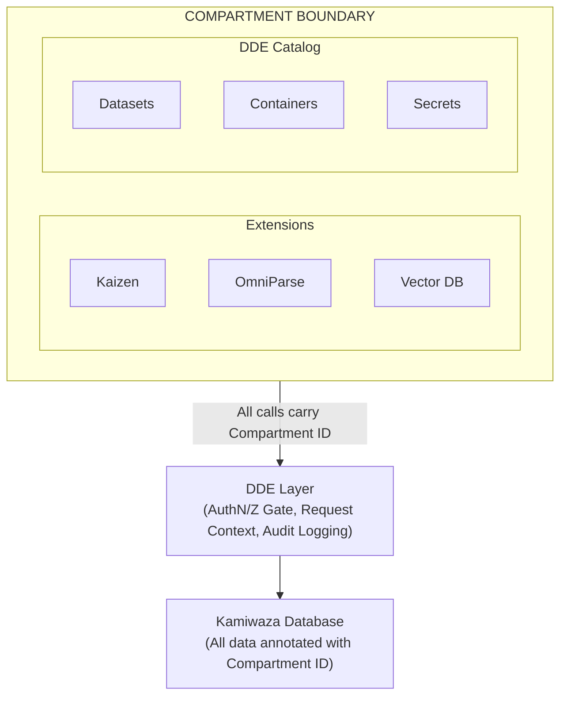

# Compartments

Compartments provide secure data isolation within Kamiwaza, enabling multi-tenant deployments and ephemeral sessions where different workloads remain completely separated from each other.

## What Are Compartments?

A Compartment is an isolation boundary that prevents resources from accessing each other across Compartment lines. Think of Compartments as separate, sealed rooms within Kamiwaza—each room has its own data and its own extensions (apps and tools), with no way to pass information between rooms.

When you enable compartmentalization:

- Each Compartment gets its own instances of apps, data processing tools, and stored data
- Resources in Compartment A cannot see or access resources in Compartment B
- Even administrators cannot tunnel data between Compartments while operating within the system
- All activity is logged with Compartment identifiers for audit purposes (see [Observability Guide](../observability.md) for details on audit logging)

### Why Use Compartments?

Compartments solve several important security and operational challenges:

**Data Isolation for Compliance:** When handling sensitive data that must remain segregated (different clients, classification levels, or regulatory domains), Compartments enforce separation at the system level rather than relying on application-level controls.

**Ephemeral Sessions:** For scenarios where data should not persist after a session ends, ephemeral Compartments automatically clean up all resources when you log out. Nothing remains—no vector embeddings, no processed documents, no conversation history.

**Multi-Tenant Deployments:** Organizations can provide isolated Kamiwaza environments to different teams or external parties on shared infrastructure without risk of data leakage.

**Defense in Depth:** Compartments add a security layer independent of user permissions. Even if a user has broad permissions, those permissions only apply within their current Compartment.

## Key Concepts

### Compartments Only Restrict Access

This is the most important thing to understand: **Compartments never grant permissions—they only take permissions away.**

Your normal Kamiwaza permissions (what you can read, write, deploy, etc.) still apply inside a Compartment. But being in a Compartment means you cannot access resources outside that Compartment, regardless of your permission level.

Example: If you're an administrator with full system access, but you're logged into Compartment A, you cannot see or modify the *resources* in Compartment B (its datasets, extensions, processed data). You would need to log out and log back into Compartment B to access those resources. However, administrators can still see that Compartment B *exists* and view its metadata (name, owner, creation date) from the Compartments management interface.

### The Global Compartment

When compartmentalization is first enabled, all existing resources belong to the **Global Compartment** (also called the default or unnamespaced Compartment). The global Compartment has special properties:

- Resources in non-global Compartments can access resources in the global Compartment if configured
- The global Compartment is where you operate when you haven't selected a specific Compartment
- You can think of global as "shared"—it's visible to all other Compartments
- Write permissions (including extension deployment and data ingest) may configured in the Global Compartment to disallow users from mistakenly adding sensitive information to this shared environment

### Ephemeral vs. Persistent Compartments

**Persistent Compartments** are named Compartments that remain until explicitly deleted. Use these when you want ongoing separation between workloads—for example, keeping different client projects isolated from each other.

**Ephemeral Compartments** are temporary Compartments that are automatically destroyed when your session ends. All resources created within an ephemeral Compartment (data, embeddings, conversation history, catalog entries) are deleted upon:

- Logging out
- Session timeout
- Kamiwaza shutdown
- System shutdown

Ephemeral Compartments are ideal for:

- Handling sensitive data that should not persist
- Demo or evaluation sessions
- Temporary analysis work that doesn't need to be saved

## What Gets Compartmentalized?

In the current implementation, compartmentalization applies to:

### Compartmentalized Resources

| Resource Type |                                                              |
|--------------|-------------|
| **Extensions** | Apps, tools, and services |
| **DDE Catalog Items** | Datasets, Containers, Secrets (see [Distributed Data Engine](../data-engine.md) for details) |
| **Processed Data** | All data stored in the Kamiwaza database is tagged with Compartment ID |

### Not Compartmentalized

These resources are shared across Compartments:

| Resource Type | Reason |
|--------------|--------|
| **Models** | Model deployments are infrastructure shared across the system |
| **User Accounts** | Identity management operates at the system level |
| **System Configuration** | Platform settings apply globally |

## How to Use Compartments

### Prerequisites

Compartmentalization requires **ReBAC (Relationship-Based Access Control)** to be enabled. Compartment IDs are enforced as part of ReBAC's access control checks. See the [ReBAC Overview](../security/rebac-overview.md) for more information about Relationship-Based Access Control.

### Enabling Compartmentalization

Compartmentalization is an opt-in feature. To enable it:

1. Ensure ReBAC is enabled for your installation (see the [ReBAC Deployment Guide](../security/rebac-deployment-guide.md) for setup instructions)
2. Navigate to **Settings** in the Kamiwaza interface
3. Locate the **Compartments** section
4. Toggle **Enable Compartmentalization**

Once enabled, you will see a Compartment indicator in the interface header showing which Compartment you're currently operating in.

### Selecting a Compartment at Login

After Compartmentalization is enabled, the login process includes a Compartment selection step:

1. Enter your username and credentials as normal
2. You will see a Compartment selector below your credentials
3. Choose from:
   - **Global** — The default Compartment (functionality may be restricted based on admin settings)
   - **[Your persistent Compartments]** — Any Compartments you've previously created
   - **New Ephemeral Session** — Creates a temporary Compartment that will be destroyed when you log out

> **Note**: Persistent Compartments may be disabled by an administrator

### Creating a Persistent Compartment

To create a new persistent Compartment:

1. Log in to the global Compartment (or any Compartment where you have management permissions)
2. Navigate to **Compartments**
3. Select **Create Compartment**
4. Provide a name for the Compartment
5. The Compartment is now available for selection at your next login

### Switching Compartments

Currently, switching Compartments requires logging out and logging back in:

1. Log out of your current session
2. Log back in with your credentials
3. Select the desired Compartment during the login process

> **Note:** In-session Compartment switching and cross-Compartment resource visualization are planned for future releases.

### Deleting a Compartment

To delete a persistent Compartment:

1. Ensure you are not currently logged into the Compartment you want to delete
2. Log in to the global Compartment
3. Navigate to **Compartments**
4. Select the Compartment to delete
5. Confirm deletion

> **Warning:** Deleting a Compartment permanently destroys all resources within it, including data, catalog entries, and configuration. This action cannot be undone.

## Security Model

### Enforcement at the Gateway

Compartment access control is enforced at the API gateway level. When you log in and select a Compartment, your session token cryptographically includes the Compartment ID. Every API call is validated against this token—there is no way to forge or spoof a different Compartment ID.

This means:

- Applications deployed within a Compartment cannot pretend to be in a different Compartment
- Even if application code attempts to access cross-Compartment resources, the request will be denied at the gateway
- Audit logs capture Compartment context for all operations (see [Observability Guide](../observability.md) for details on accessing and analyzing audit logs)

### What Compartments Protect Against

Compartments provide strong isolation against:

- **Accidental data exposure:** A misconfigured application in Compartment A cannot accidentally read data from Compartment B
- **Lateral movement:** If an application is compromised, the attacker cannot pivot to access other Compartments
- **Data persistence:** With ephemeral Compartments, sensitive data is guaranteed to be destroyed when the session ends
- **Cross-tenant leakage:** In multi-tenant deployments, one tenant's data and processing remain invisible to others

### What Compartments Do NOT Protect Against

Compartments are not a replacement for:

- **Authentication:** You still need proper user authentication (see the [Security Admin Guide](../security/admin-guide.md) for authentication configuration)
- **Authorization:** Permission controls within a Compartment still matter (see [ReBAC Overview](../security/rebac-overview.md) for details on authorization policies)
- **Network security:** Compartments operate at the application level, not the network level
- **Physical security:** Data at rest encryption and physical access controls are separate concerns

### Administrator Access

Administrators and operators have visibility into the Compartment registry, but not into Compartment contents:

**What administrators CAN see (without logging into a Compartment):**

- List of all Compartments (persistent and active ephemeral sessions)
- Compartment metadata: name, ID, owner, creation date, ephemeral status
- Which users have active sessions in which Compartments

**What administrators CANNOT see (without logging into the Compartment):**

- Resources inside a Compartment (datasets, extensions, processed data)
- Contents of data or configurations within a Compartment
- Conversation history or retrieval results

To access resources inside a Compartment, an administrator must log out and log back in selecting that specific Compartment. This creates an audit trail and ensures that Compartment access is always intentional and traceable. All Compartment access events are recorded in the audit logs (see [Observability Guide](../observability.md)).

This two-tier model allows administrators to manage the system (monitor active sessions, delete abandoned Compartments, troubleshoot issues) without inadvertently accessing sensitive Compartmentalized data.

## Architecture Overview

The following diagram shows how Compartments create isolation boundaries within Kamiwaza:

Each Compartment contains its own instance of the resources within the boundary. The DDE layer enforces access control on all operations, ensuring that requests from one Compartment cannot access resources belonging to another Compartment. For more information about the Distributed Data Engine, see the [Data Engine documentation](../data-engine.md).

---

## Appendix: Future Enhancements

The following capabilities are planned for future releases but are not included in the current implementation:

### In-Session Compartment Switching

Future versions will allow switching between Compartments without logging out. This will enable workflows where users need to reference multiple Compartments while maintaining security boundaries.

### Cross-Compartment Resource Visualization

Administrators and users with appropriate permissions will be able to view resources across Compartments from a single interface, while still being prevented from accessing the data within those resources.

### Shared Stateless Extensions

Some extensions (like Geocoder) are completely stateless and resource-intensive. Future versions may allow these to be shared across Compartments for efficiency, with appropriate side-channel analysis protections.

### Granular Compartment Permissions

Future versions may support more granular control over Compartment access, including:

- Granting specific users access to specific Compartments
- Relationship-based Compartment sharing
- Compartment hierarchies (nested Compartments)
