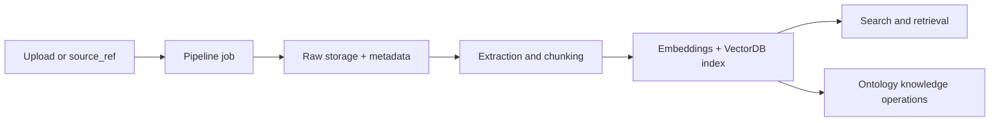

# Context Service Overview

Context Service is Kamiwaza's workroom-scoped ingestion, storage, search, and knowledge layer. It takes files or remote file references, processes them into searchable chunks, stores raw content for traceability, and exposes retrieval and knowledge APIs over the resulting data.

> **Technical preview:** Context Service is intended for advanced operators and developers. APIs and operational details may change as the service continues to harden.

## What Context Service Does

Context Service brings several capabilities under one API surface:

- **Ingestion pipelines** for uploaded files and remote source references
- **Raw file tracking** with stored metadata and temporary download access
- **Vector-backed search** for chunk-level semantic retrieval
- **Knowledge operations** for ontology-backed memory and fact search
- **Managed backends** for VectorDB, Ontology, and OmniParse instances

In practice, this means you can move from source documents to retrieval-ready context without building your own pipeline orchestration layer.

## How It Fits Into Kamiwaza

Context Service sits between source systems and retrieval consumers:

- **Distributed Data Engine** handles connector-oriented data movement and ingestion orchestration at the platform level
- **OmniParse** provides advanced extraction and parsing for supported content types
- **VectorDB backends** store embeddings and power semantic search
- **Ontology backends** store graph-style knowledge for memory and fact lookup
- **Applications and agents** call Context Service to ingest, search, and retrieve context

For related platform docs, see [Distributed Data Engine](../data-engine), [Retrieval Service](../retrieval-service), and [Platform Architecture Overview](../architecture/overview).

## Workroom Scoping

Context Service is scoped by workroom. Public endpoints expect the authorized workroom context to be supplied through the request headers, most notably:

- `X-Workroom-Id`: the workroom to operate in
- Standard auth headers or session cookies accepted by the Kamiwaza platform

Workroom scoping affects:

- which pipeline jobs you can see
- which collections are searched
- which raw files can be listed or downloaded
- which managed backend instances are visible

Context Service uses the workroom boundary to isolate data and operations. Collection names, stored files, and managed resources are resolved within that scope.

## High-Level Flow

The typical Context Service flow looks like this:

1. **Ingest** a file upload or a remote `source_ref`
2. **Store raw content** and record source metadata
3. **Extract and chunk** content through the pipeline
4. **Generate embeddings** and index chunks into a VectorDB collection
5. **Search or retrieve** context from indexed data
6. **Optionally add or query knowledge** through ontology-backed endpoints

## Main API Areas

The public REST surface is organized around a few resource families:

| Area | Purpose |
| --- | --- |
| `/context/pipelines/*` | Create, inspect, and delete pipeline jobs |
| `/context/upload/` | Upload one file directly into the pipeline |
| `/context/storage/raw/*` | List raw stored files and request temporary download URLs |
| `/context/documents/{source_urn}` | Resolve a stored source document to a temporary download URL |
| `/context/search*` | Run semantic, retrieval, and enriched search flows |
| `/context/vectordbs*` | Manage VectorDB instances and direct vector operations |
| `/context/ontologies*` | Manage ontology instances and knowledge operations |
| `/context/collections/*` | Manage workroom-scoped collections |
| `/context/omniparses*` | Manage OmniParse instances in preview |

## When To Use It

Context Service is a good fit when you need:

- a workroom-aware ingestion pipeline
- semantic retrieval over uploaded or remotely referenced documents
- traceable source metadata and raw-file retention
- graph-backed memory or knowledge search
- platform-managed vector and ontology backends

If you need connector-centric workflows first, start with [Distributed Data Engine](../data-engine). If you only need dataset retrieval against existing datasets, start with [Retrieval Service](../retrieval-service).

## Next Steps

- Use [Ingestion and Storage](./ingestion-and-storage) to understand pipeline jobs, uploads, remote ingestion, and raw-file access
- Use [Search and Knowledge](./search-and-knowledge) to understand search modes and ontology operations
- Use [Managed Backends and Lifecycle](./managed-backends-and-lifecycle) for managed resource operations and archive behavior
- Use [Operations and API Reference](./operations-and-api-reference) for the compact route inventory
