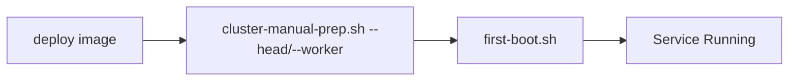

# Installing Kamiwaza

## Overview

Kamiwaza can be installed in several configurations:
- **Ubuntu .deb Package** (Recommended for Ubuntu 22.04 and 24.04)
- Community Edition on Windows (single-node, WSL2)
- Community Edition on OSX (single-node)
- Community Edition on Linux (single-node)
- Enterprise Edition (cluster-capable)

## Before You Begin

**Please review the [System Requirements](system_requirements.md) before proceeding with installation.** This document covers:
- Supported operating systems and versions
- Hardware requirements (CPU, RAM, storage)
- Required system packages and dependencies
- Network and storage configuration
- GPU support requirements

## Installation Workflows

### 1. Ubuntu .deb Package Installation (Recommended)

For Ubuntu 22.04 or 24.04 users, the simplest installation method is using the official .deb package:

**Steps:**
1. Download the Kamiwaza .deb package from the official repository
2. Install using: `sudo dpkg -i kamiwaza-*.deb`
3. Resolve any dependencies: `sudo apt-get install -f`
4. The service will start automatically

**Benefits:**
- Automated dependency resolution
- System integration via package management
- Simplified updates and removal
- No manual configuration required

### 2. Community Edition on Windows

Simple, automated installation with GPU acceleration support:

**Key Features:**
- Automatic WSL2 Ubuntu 24.04 setup
- GPU detection (NVIDIA RTX, Intel Arc, Intel Integrated)
- Start Menu shortcuts for easy management
- Automatic port reservation (61100-61299)
- GPU acceleration configuration

**Requirements:**
- Windows 11 with WSL2 support
- Compatible GPU (NVIDIA RTX series, Intel Arc, Intel Integrated)
- 8GB+ RAM (16GB+ recommended)

**Quick Start:**
1. Ensure WSL is installed (`wsl --install`)
2. Download and run the Kamiwaza MSI installer as administrator
3. Configure email, license, and memory allocation
4. Access via browser at `https://localhost` or Start Menu shortcuts

📋 **For detailed step-by-step instructions, troubleshooting, and advanced configuration, see the [Windows Installation Guide](windows_installation.md).**

### 3. Community Edition on Mac OSX

Simple, single-command installation:

### 4. Community Edition on Linux

Windows installation uses an MSI installer that sets up Kamiwaza in a dedicated WSL environment.

**Key Features:**
- Fully automated WSL configuration with Ubuntu 24.04
- GPU acceleration support (NVIDIA RTX, Intel Arc)
- Integrated with Windows Start Menu
- Configurable memory allocation (50-75% of system RAM)
- Automatic network port reservation (61100-61299)

### 5. Enterprise Edition

#### A. Terraform Deployment (Recommended)

Key Points:
- Terraform handles complete cluster setup
- cloud-init automatically runs first-boot.sh
- Service starts automatically via systemd

#### B. Manual Cluster Deployment

Key Points:
- Requires manual cluster setup via cluster-manual-prep.sh
- Must specify correct role (`--head` or `--worker --head-ip=<IP>`)
- Service starts automatically via systemd

## Installation Method Selection

| Method | Best For | Complexity | Features |
|--------|----------|------------|----------|
| **Ubuntu .deb Package** | Ubuntu 22.04 users | ⭐ | Community Edition, automated setup |
| Community Edition (OSX) | macOS developers | ⭐⭐ | Single-node, local development |
| Community Edition (Linux) | Linux users, custom setups | ⭐⭐ | Single-node, manual control |
| **Windows Edition** | Windows 11 users | ⭐⭐ | WSL-based, GPU support, automated setup |
| Enterprise Edition | Production clusters | ⭐⭐⭐⭐ | Multi-node, full features |

## Important Notes

1. **Ubuntu .deb Package:**
   - Simplest installation method for Ubuntu 22.04
   - Automated dependency management
   - System service integration

2. Community Edition:
   - **Windows**: Automated MSI installer with WSL2 setup and GPU acceleration
   - **OSX**: Simple install.sh --community command
   - **Linux**: Choose between direct install or automated setup sequence
   - Automated setup (1.sh -> 2.sh -> 3.sh) handles prerequisites and NVIDIA container testing

3. Windows Edition:
   - MSI installer provides fully automated WSL setup
   - Supports GPU acceleration with NVIDIA RTX and Intel Arc
   - Integrated with Windows Start Menu and accessible via browser
   - Memory allocation configurable during installation (recommended 50-75% of system RAM)
   - See [Windows Installation Guide](windows_installation.md) for comprehensive instructions

4. Enterprise Edition:
   - Terraform method provides fully automated deployment
   - Manual method requires explicit cluster role specification
   - Both methods result in automatically running services

5. Service Management:
   - **Windows**: Start Menu shortcuts and WSL commands for platform management
   - **Linux/OSX**: first-boot.sh configures and starts the service via systemd
   - No need to manually run startup scripts

6. GPU Acceleration:
   - **Windows**: Automatic detection and configuration for NVIDIA RTX, Intel Arc, and Intel Integrated GPUs
   - **Linux**: NVIDIA container runtime support
   - **OSX**: Metal framework support (if applicable)
