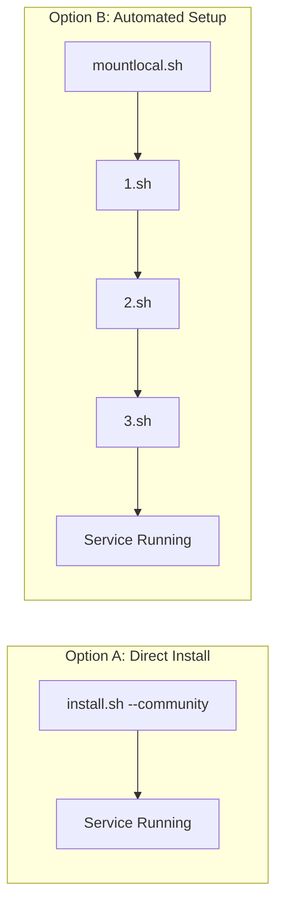
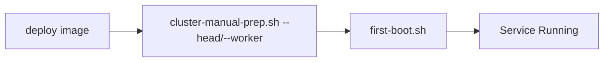

# Installing Kamiwaza

## Overview

Kamiwaza can be installed in four main configurations:
- Community Edition on Windows (single-node, WSL2)
- Community Edition on OSX (single-node)
- Community Edition on Linux (single-node)
- Enterprise Edition (cluster-capable)

## Installation Workflows

### 1. Community Edition on Windows

Simple, automated installation with GPU acceleration support:

**Key Features:**
- Automatic WSL2 Ubuntu 24.04 setup
- GPU detection (NVIDIA RTX, Intel Arc, Intel Integrated)
- Start Menu shortcuts for easy management
- Automatic port reservation (61100-61299)
- GPU acceleration configuration

**Requirements:**
- Windows 11 with WSL2 support
- Compatible GPU (NVIDIA RTX series, Intel Arc, Intel Integrated)
- 8GB+ RAM (16GB+ recommended)

### 2. Community Edition on OSX

Simple, single-command installation:

### 3. Community Edition on Linux

Two options available:

Note: `mountlocal.sh` is only needed for Azure deployments requiring specific disk configurations.
The automated setup sequence (1.sh -> 2.sh -> 3.sh) can be used on any Linux system, but is primarily tested on Azure.

### 4. Enterprise Edition

#### A. Terraform Deployment (Recommended)

Key Points:
- Terraform handles complete cluster setup
- cloud-init automatically runs first-boot.sh
- Service starts automatically via systemd

#### B. Manual Cluster Deployment

Key Points:
- Requires manual cluster setup via cluster-manual-prep.sh
- Must specify correct role (`--head` or `--worker --head-ip=<IP>`)
- Service starts automatically via systemd

## Important Notes

1. Community Edition:
   - **Windows**: Automated MSI installer with WSL2 setup and GPU acceleration
   - **OSX**: Simple install.sh --community command
   - **Linux**: Choose between direct install or automated setup sequence
   - Automated setup (1.sh -> 2.sh -> 3.sh) handles prerequisites and NVIDIA container testing

2. Enterprise Edition:
   - Terraform method provides fully automated deployment
   - Manual method requires explicit cluster role specification
   - Both methods result in automatically running services

3. Service Management:
   - **Windows**: Start Menu shortcuts and WSL commands for platform management
   - **Linux/OSX**: first-boot.sh configures and starts the service via systemd
   - No need to manually run startup scripts

4. GPU Acceleration:
   - **Windows**: Automatic detection and configuration for NVIDIA RTX, Intel Arc, and Intel Integrated GPUs
   - **Linux**: NVIDIA container runtime support
   - **OSX**: Metal framework support (if applicable)