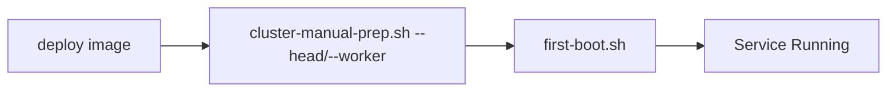

# Installing Kamiwaza

## Before You Begin

**Please review the [System Requirements](system_requirements.md) before proceeding with installation.** This document covers:
- Supported operating systems and versions
- Hardware requirements (CPU, RAM, storage)
- Required system packages and dependencies
- Network and storage configuration
- GPU support requirements

## Installation Workflows

### Community Edition on Windows

Use the MSI installer for a streamlined WSL2-based setup. See the [Windows Installation Guide](windows_installation_guide.md) for prerequisites, GPU support, and step-by-step instructions.

Steps:
1. Download: `KamiwazaInstaller-[version]-[arch].msi`
2. Install: Run the MSI (as Administrator)
3. Launch: Start Menu → "Start Platform" or open `https://localhost`

### Linux

#### Ubuntu .deb Package Installation

1. Download the Kamiwaza .deb package from the official repository
2. Install using: `sudo apt install -y ./kamiwaza-<version>.deb`
3. Verify service starts (see [Quickstart](quickstart.md))

#### Other Distros: Pre-built bundles (Community Edition only)

1. Follow the consolidated guide: [Linux/macOS tarball installation](linux_macos_tarball.md)
2. Ensure Docker Engine (with Compose v2), Python 3.10, and Node.js 22 are available (installer may configure as needed)
3. Run `install.sh --community`
4. Access via browser at `https://localhost`

### Community Edition on macOS

_Only Community Edition is supported on macOS._

Follow the consolidated guide: [Linux/macOS tarball installation](linux_macos_tarball.md)

### Enterprise Edition Deployment

#### A. Terraform Deployment (Recommended)

Key Points:
- Terraform handles complete cluster setup
- cloud-init automatically runs first-boot.sh
- Service starts automatically via systemd

#### B. Manual Cluster Deployment

Key Points:
- Requires manual cluster setup via cluster-manual-prep.sh
- Must specify correct role (`--head` or `--worker --head-ip=<IP>`)
- Service starts automatically via systemd

## Important Notes

1. Ubuntu .deb Package:
   - Simplest installation method for Ubuntu 22.04/24.04
   - Automated dependency management
   - System service integration

2. Community Edition:
   - **Windows**: Use the MSI installer (see [Windows Installation Guide](windows_installation_guide.md))
   - **macOS**: Run `install.sh --community`
   - **Linux**: Use the `.deb` on Ubuntu or `install.sh --community` on other distros

3. Windows Edition:
   - See the [Windows Installation Guide](windows_installation_guide.md) for complete setup, GPU support, and troubleshooting

4. Enterprise Edition:
   - Terraform method provides fully automated deployment
   - Manual method requires explicit cluster role specification
   - Both methods result in automatically running services

5. Service Management:
   - **Windows**: Managed via Start Menu shortcuts and WSL commands (see [Windows Installation Guide](windows_installation_guide.md))
   - **Linux/macOS**: `first-boot.sh` configures and starts the service via systemd
   - No need to manually run startup scripts

6. GPU Acceleration:
   - Availability and setup vary by platform and hardware
   - See the [Windows GPU Setup Guide](gpu_setup_guide.md) for supported GPUs and configuration

## Related Documentation
- [System Requirements](system_requirements.md)
- [Windows Installation Guide](windows_installation_guide.md)
- [Windows GPU Setup Guide](gpu_setup_guide.md)

## Updating Kamiwaza

### Windows
- Download new MSI installer and run to update existing installation
- Restart if prompted for GPU changes

### Linux/macOS
- Download new package
- Run installation script again
- Service will restart automatically

## Uninstallation

### Windows
- Use "Cleanup WSL" shortcut, or uninstall via Windows Settings → Apps

### Linux/macOS
- Remove package via package manager
- Clean up any remaining configuration files
