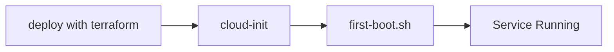
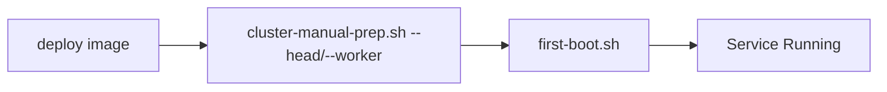

# Installing Kamiwaza

## Before You Begin

**Please review the [System Requirements](system_requirements.md) before proceeding with installation.** This document covers:
- Supported operating systems and versions
- Hardware requirements (CPU, RAM, storage)
- Required system packages and dependencies
- Network and storage configuration
- GPU support requirements

## Installation Workflows

### Linux

#### Ubuntu 24.04 (Noble)

| Architecture | Download |
|--------------|----------|
| x86_64 | [kamiwaza_v0.9.3_noble_x86_64.deb](https://packages.kamiwaza.ai/deb/kamiwaza_v0.9.3_noble_x86_64.deb) |
| ARM64 | [kamiwaza_v0.9.3_noble_arm64.deb](https://packages.kamiwaza.ai/deb/kamiwaza_v0.9.3_noble_arm64.deb) |

```bash
# Update package index
sudo apt-get update

# Download the package (x86_64 example, replace with ARM64 variant as needed)
curl -LO https://packages.kamiwaza.ai/deb/kamiwaza_v0.9.3_noble_x86_64.deb

# Install
sudo dpkg -i kamiwaza_v0.9.3_noble_x86_64.deb
sudo apt-get install -f
```

#### Ubuntu 22.04 (Jammy)

| Architecture | Download |
|--------------|----------|
| x86_64 | [kamiwaza_v0.9.3_jammy_x86_64.deb](https://packages.kamiwaza.ai/deb/kamiwaza_v0.9.3_jammy_x86_64.deb) |
| ARM64 | [kamiwaza_v0.9.3_jammy_arm64.deb](https://packages.kamiwaza.ai/deb/kamiwaza_v0.9.3_jammy_arm64.deb) |

```bash
sudo apt-get update
curl -LO https://packages.kamiwaza.ai/deb/kamiwaza_v0.9.3_jammy_x86_64.deb
sudo dpkg -i kamiwaza_v0.9.3_jammy_x86_64.deb
sudo apt-get install -f
```

#### NVIDIA DGX Spark

A dedicated package for DGX Spark with Grace Blackwell CPU, including CUDA-ARM dependencies. For two-node deployments, install Kamiwaza on the **head node only** — the worker node only requires Docker and SSH access.

| Architecture | Download |
|--------------|----------|
| ARM64 | [kamiwaza_v0.9.5_noble_arm64_dgx.deb](https://packages.kamiwaza.ai/deb/kamiwaza_v0.9.5_noble_arm64_dgx.deb) |

```bash
sudo apt-get update
curl -LO https://packages.kamiwaza.ai/deb/kamiwaza_v0.9.5_noble_arm64_dgx.deb
sudo dpkg -i kamiwaza_v0.9.5_noble_arm64_dgx.deb
sudo apt-get install -f
```

For two-node DGX Spark deployments (tensor parallelism across a Spark pair), see the [Two-Node Deployment Guide](two-node-deployment.md).

#### Post-Installation Steps

After installation, clean up and start Kamiwaza:

```bash
# Clean up containers from the installation process
kamiwaza stop

# (Optional) Edit environment configuration for your deployment
# e.g., two-node setup, external URLs, authentication
sudo vi /opt/kamiwaza/kamiwaza/env.sh

# Start Kamiwaza
kamiwaza start
```

Verify service starts (see [Quickstart](quickstart.md))

#### RHEL .rpm Package Installation (for RHEL 9)

**For standard online installation (recommended)**, see the [Red Hat Installation Guide](redhat_online_install.md) for complete step-by-step instructions including Docker setup and system dependencies.

**For air-gapped or offline RHEL environments**, see the [Red Hat Offline Installation Guide](redhat_offline_install.md).

**Quick install** (for users who already have Docker and dependencies installed):

```bash
# Download the package
curl -LO https://packages.kamiwaza.ai/rpm/kamiwaza_v0.9.3_rhel9_x86_64.rpm

# Install the package
sudo -E KAMIWAZA_ACCEPT_LICENSE=yes dnf install ./kamiwaza_v0.9.3_rhel9_x86_64.rpm


# Alternatively, for Enterprise Mode, Install the package with Kamiwaza License Key
sudo -E KAMIWAZA_ACCEPT_LICENSE=yes -E KAMIWAZA_LICENSE_KEY="YOUR_LICENSE_KEY" dnf install ./kamiwaza_v0.9.3_rhel9_x86_64.rpm
```

### Community Edition on macOS

_Only Community Edition is supported on macOS._

1. Follow the guide: [macOS tarball installation](macos_tarball.md)
2. Ensure Docker Desktop is installed and running
3. Run `install.sh --community`
4. Access via browser at `https://localhost`

### Community Edition on Windows

Use the MSI installer for a streamlined WSL2-based setup. See the [Windows Installation Guide](windows_installation_guide.md) for prerequisites, GPU support, and step-by-step instructions.

Steps:
1. Download: `KamiwazaInstaller-[version]-[arch].msi`
2. Install: Run the MSI (reboot when prompted)
3. Launch: Start Menu → "Kamiwaza Start"


### Enterprise Edition Deployment

#### A. Terraform Deployment (Recommended)


```mermaid
flowchart LR
    deploy[deploy with terraform] --> init[cloud-init]
    init --> first[first-boot.sh]
    first --> running[Service Running]
```

Key Points:
- Terraform handles complete cluster setup
- cloud-init automatically runs first-boot.sh
- Service starts automatically via systemd

#### B. Manual Cluster Deployment


```mermaid
flowchart LR
    deploy[deploy image] --> prep["cluster-manual-prep.sh --head/--worker"]
    prep --> first[first-boot.sh]
    first --> running[Service Running]
```

Key Points:
- Requires manual cluster setup via cluster-manual-prep.sh
- Must specify correct role (`--head` or `--worker --head-ip=<IP>`)
- Service starts automatically via systemd


## Updating Kamiwaza

### Windows
- Download new MSI installer and run to update existing installation
- Restart if prompted for GPU changes

### Linux/macOS
- Download new package
- Run installation script again
- Service will restart automatically

## Uninstallation

### Windows
- Windows Settings → Add or Remove Programs -> (three dots on side) Uninstall

### Linux/macOS
- Remove package via package manager
- Clean up any remaining configuration files
