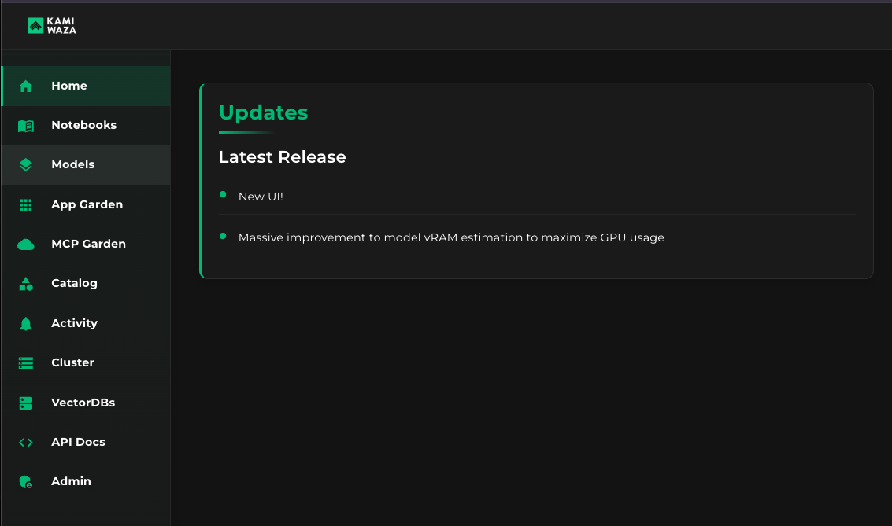
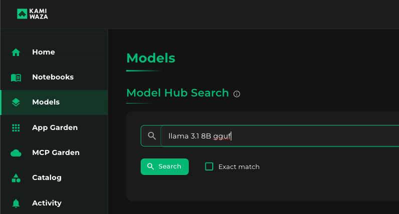
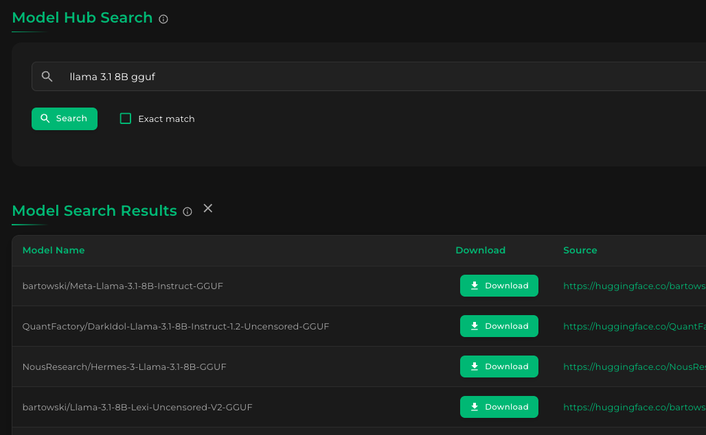
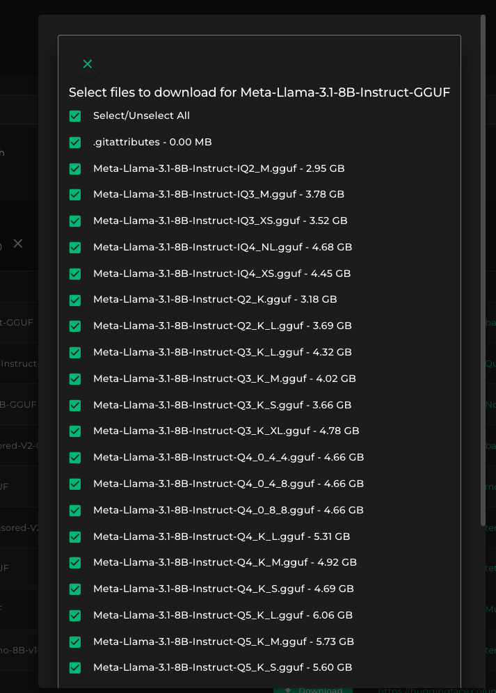
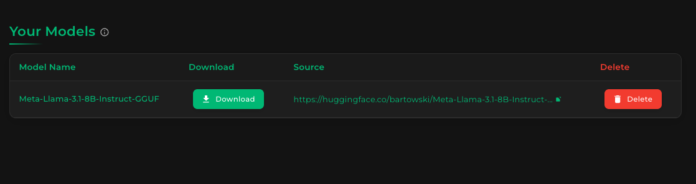
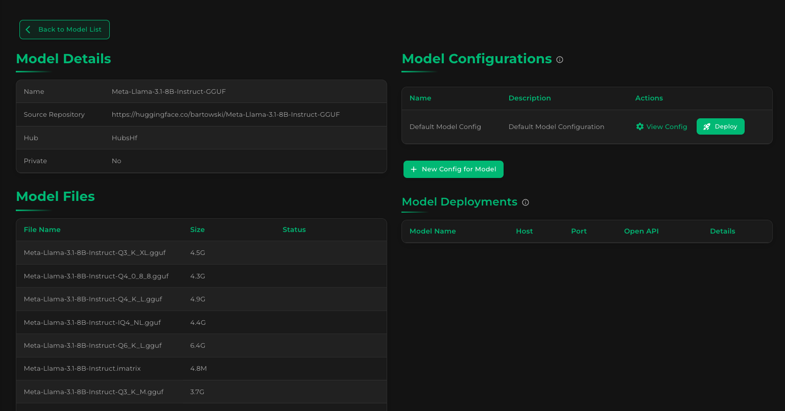
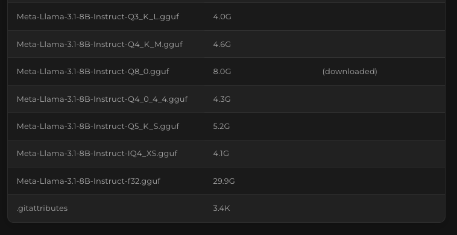
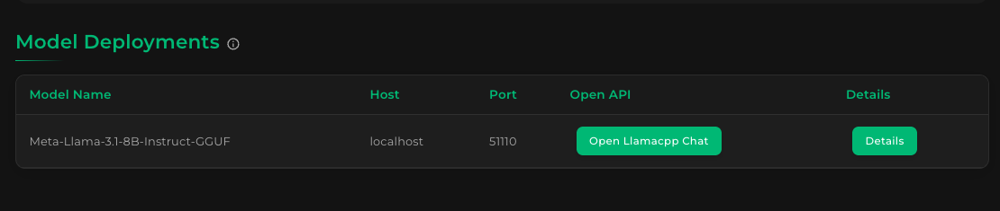
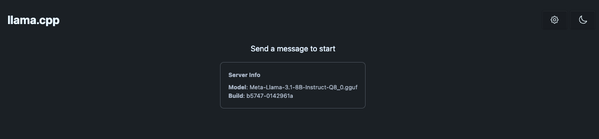
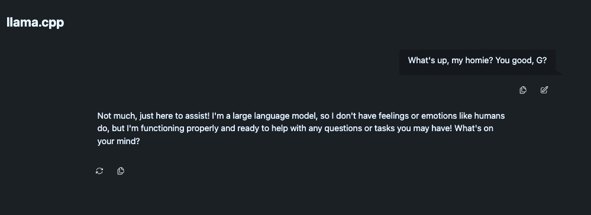

# Models

Kamiwaza provides a comprehensive system for managing the entire lifecycle of your AI models, from discovery and download to deployment and serving. This guide walks you through the key concepts and processes for working with models on the Kamiwaza platform.

## Model Search and Discovery

Kamiwaza is integrated directly with the Hugging Face Hub, allowing you to access a vast collection of open-source models. Models are identified by their Hugging Face repository ID, such as `meta-llama/Llama-3.3-70B-Instruct`.

### Downloading Models

When you select a model to deploy, Kamiwaza handles the download process for you:

1.  **Find the Model**: The system first checks if the model already exists locally. If not, it searches the Hugging Face Hub for the specified repository ID.
2.  **File Selection**: For repositories containing multiple file types, you will want to select the most appropriate files for your hardware. For example, when running on hardware without a GPU, you can select and download specific GGUF files (`q6_k`, `q5_k_m`, etc.) for optimal performance with the `llama.cpp` engine. On a Linux server with GPUs, you may opt to download the standard model files (like `.safetensors`) for use with the `vLLM` engine.
3.  **Local Caching**: All downloaded model files are stored in a local cache directory on the platform. This means that subsequent requests for the same model will not require a new download, making deployments faster.

Once a model's files are downloaded and verified, they are registered within Kamiwaza and become available for deployment.

## Choosing the Right Model

Selecting the right model and configuration is crucial for achieving optimal performance and efficiency. The Kamiwaza platform automatically selects the best serving engine for your hardware and model type, but understanding the options will help you make informed decisions.

### Model Formats and Engine Compatibility

Kamiwaza supports several model formats, each best suited for different serving engines and hardware configurations:

*   **GGUF**: These models are highly optimized for CPU inference and are the standard for the `llama.cpp` engine. They are ideal for running on consumer hardware, including laptops with Apple Silicon, and support various quantization levels to reduce memory requirements.
*   **Safetensors**: This is a safe and fast format for storing and loading tensors. On macOS with Apple Silicon, `.safetensors` models are best served by the `MLX` engine to take full advantage of the GPU. On Linux with NVIDIA, AMD and other supported GPUs or accelerators (for example, Intel Gaudi 3), they are typically served with `vLLM`.
*   **Other formats (PyTorch, etc.)**: General-purpose models are typically served using `vLLM` on servers equipped with NVIDIA or AMD GPUs.

## Model Serving Engines

Kamiwaza intelligently routes model deployment requests to the most appropriate serving engine. Here are the primary engines available in the platform:

### vLLM Engine

*   **Purpose**: Designed for high-throughput, low-latency LLM serving on powerful GPUs.
*   **Best For**: Production environments with dedicated accelerators, such as NVIDIA or AMD GPUs.
*   **Key Features**:
    *   **PagedAttention**: An advanced attention algorithm that dramatically reduces memory waste.
    *   **Continuous Batching**: Batches incoming requests on the fly for better GPU utilization.
    *   **Tensor Parallelism**: Distributes large models across multiple GPUs.

### llama.cpp Engine

*   **Purpose**: Optimized for efficient CPU-based inference and a popular choice for running models on consumer hardware.
*   **Best For**:
    *   Running models on machines without a dedicated high-end GPU.
    *   Local development on both Intel-based and Apple Silicon Macs.
*   **Key Features**:
    *   **GGUF Format**: Uses GGUF format which supports various levels of quantization for memory efficiency.
    *   **Cross-Platform**: Runs on Linux, macOS, and Windows.
    *   **Metal Acceleration**: On macOS, uses the Apple Silicon GPU for acceleration.

### MLX Engine

*   **Purpose**: Specifically built to take full advantage of Apple Silicon (M series) chips.
*   **Best For**: High-performance inference on modern Mac computers.
*   **Key Features**:
    *   **Unified Memory**: Leverages the unified memory architecture of Apple Silicon for efficient data handling.
    *   **Native Process**: Runs as a native macOS process, not in a container, for direct hardware access.
    - **Vision-Language Models**: Supports multi-modal models.

### Ampere llama.cpp Engine

*   **Purpose**: A specialized variant of `llama.cpp` optimized for Ampere arm-based CPU architectures.
*   **Best For**: Running GGUF models on Ampere CPUs, such as the AmpereOne M servers.

## Model Deployment

The model deployment process in Kamiwaza is designed to be simple and robust.

1.  **Initiate Deployment**: When you request to deploy a model, Kamiwaza's `Models Service` takes over.
2.  **Engine Selection**: The platform automatically determines the best engine based on your hardware, operating system, and the model's file format. For example, on a Mac with an M2 chip, a `.gguf` file will be deployed with `llama.cpp`, while `.safetensors` will use `MLX`. You can also override this and specify an engine manually.
3.  **Resource Allocation**: The system allocates a network port and configures the load balancer (Traefik) to route requests to the new model endpoint.
4.  **Launch**: The selected engine is started. For `vLLM` on Linux, this is a Docker container. For `MLX` on macOS, it's a native process.
5.  **Health Check**: Kamiwaza monitors the model until it is healthy and ready to serve traffic.

Once deployed, your model is available via a standard API endpoint.

## GUI Walkthrough
The following walkthrough is based on the Kamiwaza 1.0.0 user interface. We'll walk through navigating the Kamiwaza admin console to **search** for a model, **download** model files, and then **deploy and use** an inference endpoint.

### Step 1: Find and click the Models menu in the sidebar

### Step 2: Under Model Hub Search, type keywords for your desired model
In this example, I'm looking for a GGUF of Llama3.1 8B Instruct, so I type a few of its keywords to narrow results.

Clicking the **Search** button will show the results, like this:

### Step 3: Download models files from chosen model
From the results, let's choose the Bartowski GGUF. Clicking the **Download** button for *bartowski/Meta-Llama-3.1-8B-Instruct-GGUF* results in the following:

In this example, we are downloading GGUF models for a llamacpp inference engine deployment. Unlike normal Hugging Face models (safetensors), we only need to download one or a couple files - just the specific quantized model that we need. 

For this example, we will uncheck everything and choose only the **Q8_0** variant. Click **Select/Unselect"** all to uncheck all files, then scroll down and click the file marked **Q8_0** (near the very bottom), and then click **Download Selected Files** to download the 8-bit quantized version of Llama 3.1 8B Instruct in GGUF format.

> NOTE: In normal Hugging Face models (non-GGUF), we usually need to download all files in order to serve a model (safetensors, config, tokenizer, etc), hence having everything pre-checked. We'd only need to scroll down and click the **Download Selected Files** button.

## Step 4: Check the model files after the download
After the download, your Kamiwaza models console will look something like this:

Your downloaded model is displayed. To view the specific files downloaded for this model, click the name of the model in the list. You'll see a screen that looks like this:

You'll notice most of the files under **Model Files** have an empty status, since we didn't download them. Scroll down to see if our 8-bit quantized GGUF is present, though:

And yep, as expected, our Q8_0-quantized GGUF is there. Since it is already marked as "downloaded", that means we can deploy it already.

## Step 5: Deploy a model for serving

We've already seen the **Deploy** button earlier, at the upper right area of the Model Details screen, under Model Configurations:

Kamiwaza creates a default config for us when we download a model, to simplify the deployment experience. 

Click **"Deploy"** to launch an instance. When the spinner finishes, click **Back to Model List** to go back to the main Models screen.

## Step 6: Testing the deploymed model endpoint

In the main Models screen, under Model Deployments, you will see a new entry for our recently deployed Llama 3.1 8B model:

To test our model, click "Open Llamacpp Chat". Your browser will open a chat application running against the deployed model:

Let's send a test message to validate that our LLM endpoint is working:

Perfect! If you see a response like that, then our inference endpoint is working as expected. 

**🎉 You've successfully deployed your first model on Kamiwaza! 🎉**