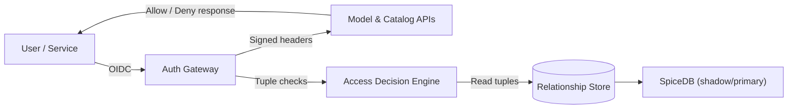

# Relationship-Based Access Control Overview

Kamiwaza uses relationship-based access control (ReBAC) to enforce tenant-scoped and role-aware policies across the platform. This page summarizes the capabilities delivered with the current release, how to integrate an identity provider, and the operational practices required to keep the system healthy.

## What ReBAC Delivers

- **Deny by default** – every protected API checks for an explicit `subject → relation → resource` tuple before permitting access.
- **Context-aware policies** – relations cover ownership, editor/viewer roles, clearance tiers, and nested group membership.
- **Runtime updates** – policy manifests and tenant bootstrap files can be replayed without restarting services.
- **Auditable decisions** – each authorization call records the decision, reason, backend, and correlation ID.
- **Shadow cutover** – Postgres and SpiceDB can run in parallel to verify parity before promoting SpiceDB to the primary backend.
- **Automatic ownership tuples** – when `AUTH_REBAC_ENABLED=true`, catalog/model uploads seed owner/editor/viewer tuples automatically so creators can immediately list and download their assets.

## Architecture Snapshot



| Component | Purpose | Notes |
| --- | --- | --- |
| Auth Gateway | Terminates OIDC sessions, issues personal access tokens (PAT), forwards signed headers. | Keycloak is supported today; SAML/card reader flows are roadmap items. |
| Access Decision Engine | Evaluates tuples stored in Postgres or SpiceDB and returns permit/deny with reasoning. | Targets &lt;100 ms latency for typical requests. |
| Relationship Store | Persists tuple data and mirrors to SpiceDB when enabled. | Ships with default tuples for system tenants. |
| Service Guards | Wrap API endpoints with `enforce_*` helpers to require specific relations. | Catalog dataset deletes and model deletes ship protected in this release. |
| Policy Assets | `configs/rebac/policies/*.yaml` and tenant bootstraps under `configs/rebac/tenants/`. | Validate before applying changes. |

## Identity Provider Integration

1. **Create a confidential client** in your identity provider (Keycloak in the reference deployment).
   - Client ID must match `AUTH_GATEWAY_JWT_AUDIENCE` (default `kamiwaza-platform`).
   - Allowed redirect URI: the external URL of the Kamiwaza deployment (`https://<gateway>/api/auth/callback`).

2. **Expose required claims** in the ID token or user info endpoint.
   - Include `roles`, `tenant`, and any clearance attributes referenced in policies.
   - Ensure the token carries `exp`, `iat`, `sub`, and `iss` claims; Kamiwaza validates them on every request.

3. **Configure the Auth Gateway** (environment variables or `env.sh`).
   - Set the issuer and JWKS URL to match your Keycloak realm (`https://<keycloak>/realms/<realm>` and `/protocol/openid-connect/certs`).
   - Align `AUTH_GATEWAY_JWT_AUDIENCE` with the confidential client you created (`kamiwaza-platform` by default).
   - Enable ReBAC (`AUTH_REBAC_ENABLED=true`) and choose your primary backend (`postgres` or `spicedb`).
   - Point the session store at your Redis deployment (`AUTH_REBAC_SESSION_REDIS_URL=rediss://<redis-host>:6380/0`).
   - Define the default tenant fallback (`AUTH_REBAC_DEFAULT_TENANT_ID="__default__"` for single-tenant labs) and enable PAT tagging (`AUTH_PAT_TENANT_TAGGING_ENABLED=true`) so newly issued tokens include tenant metadata.
   - See the [ReBAC Deployment Guide](./rebac-deployment-guide.md) for the full variable list and examples.

4. **Optional PAT workflow** – use the Auth gateway PAT endpoint to issue automation tokens that embed tenant metadata.

## Policy Management

1. **Review the shipping manifest** (`configs/rebac/policies/default.yaml`) to understand default relations for models, datasets, and administrative roles.
2. **Validate changes** with the provided helper:
   ```bash
   python scripts/rebac_policy.py validate configs/rebac/policies/default.yaml
   ```
3. **Apply tenant manifests** using:
   ```bash
   python scripts/rebac_tenant.py apply --manifest configs/rebac/tenants/__default__.yaml
   ```
   Manifests seed tuples for new tenants and can be re-run safely.
4. **Promote across environments** by storing sanitized manifests in version control and replaying them through your change-management pipeline. Capture tuple plans and policy hashes for audit evidence.

## Operations Checklist

- **Gateway policy** – enable `default_deny: true` and explicitly list the `/api/*` paths users require.
- **Shadow validation** – run with `AUTH_REBAC_BACKEND=postgres` and `AUTH_REBAC_SHADOW_COMPARE=true` until SpiceDB decisions match Postgres, then cut over.
- **Monitoring** – tail structured `rebac_decision` logs today; metrics endpoints will be documented when generally available.
- **Session store** – ensure Redis is served over TLS (`rediss://`), authentication is enabled, and session TTLs match your security policy (default 8 hours).
- **Audit artifacts** – capture policy validation output, tuple plans, and decision logs for the release record.

## Demonstrating ReBAC

For a walkthrough that exercises authentication, tuple enforcement, and observability dashboards, follow the [ReBAC Validation Checklist](./rebac-validation-checklist.md). It covers token capture, allow/deny checks, and the expected log output for accreditation reviews.

## Limitations & Roadmap

- SAML and CAC/token-based sign-in are roadmap items; OIDC (Keycloak) is supported today.
- Ingestion job ownership remains coarse-grained (admin-only). Tuple-based ownership and list/delete APIs will follow in a future release.
- ReBAC currently covers catalog/model APIs; ingestion write paths, retrieval, and custom connectors will be added in upcoming updates.

Need help integrating ReBAC or exporting evidence for accreditation? Reach out to your Kamiwaza support representative for the latest runbooks and automation scripts.

## Next steps

- Follow the [ReBAC Deployment Guide](./rebac-deployment-guide.md) to configure the gateway.
- Run the [ReBAC Validation Checklist](./rebac-validation-checklist.md) to validate tuple enforcement and logging.
