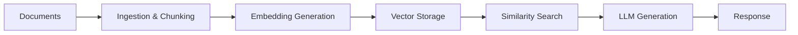

# Building a RAG Pipeline

Retrieval-Augmented Generation (RAG) combines the power of large language models with your own documents and data to provide accurate, contextual responses. This guide walks you through building a complete RAG pipeline using Kamiwaza's core services.

## What You'll Build

By the end of this guide, you'll have:
- **Document ingestion system** that processes various file formats
- **Embedding pipeline** that converts text to vector representations
- **Vector search system** for finding relevant context
- **LLM integration** that generates responses using retrieved context
- **Web interface** for querying your documents

## Prerequisites

Before starting, ensure you have:
- Kamiwaza installed and running ([Installation Guide](../installation/installation_process))
- At least 16GB of available RAM
- Sample documents (PDFs, text files, etc.) to process
- Basic familiarity with Python (for SDK examples)

## Architecture Overview

A RAG pipeline consists of four main components:



## Step 1: Deploy Required Models

First, we'll deploy an embedding model for vectorizing text and a language model for generating responses.

### Deploy an Embedding Model

The embedding model will be automatically loaded when you create an embedder - no manual deployment needed:

```python
from kamiwaza_client import KamiwazaClient

client = KamiwazaClient(base_url="http://localhost:7777/api/")

# The embedding model will be automatically loaded when you create an embedder
# This happens seamlessly in the background
embedder = client.embedding.get_embedder(
    model="BAAI/bge-base-en-v1.5",
    provider_type="huggingface_embedding"
)

print("✅ Embedding model ready for use")
```

### Deploy a Language Model

Deploy a language model using Kamiwaza for response generation:

```python
from kamiwaza_client import KamiwazaClient

client = KamiwazaClient(base_url="http://localhost:7777/api/")

# Search for a suitable language model
model_repo = "Qwen/Qwen3-0.6B-GGUF"  # Small efficient model
models = client.models.search_models(model_repo, exact=True)
print(f"Found model: {models[0]}")

# Download the model (this may take a few minutes)
print("Downloading model...")
client.models.initiate_model_download(model_repo)
client.models.wait_for_download(model_repo)
print("✅ Model download complete")

# Deploy the model
print("Deploying model...")
deployment_id = client.serving.deploy_model(repo_id=model_repo)
print(f"✅ Model deployed with ID: {deployment_id}")

# Get OpenAI-compatible client for the deployed model
openai_client = client.openai.get_client(repo_id=model_repo)
print("✅ OpenAI-compatible client ready")
```

**Check Deployment Status**
```python
# List active deployments to verify
deployments = client.serving.list_active_deployments()
for deployment in deployments:
    print(f"✅ {deployment.m_name} is {deployment.status}")
    print(f"   Endpoint: {deployment.endpoint}")
```

## Step 2: Document Ingestion Pipeline

Now we'll create a pipeline to process documents, chunk them, and generate embeddings.

### Document Processing Script

```python
import os
from pathlib import Path
from typing import List, Dict
from kamiwaza_client import KamiwazaClient

class RAGPipeline:
    def __init__(self, base_url="http://localhost:7777/api/"):
        self.client = KamiwazaClient(base_url=base_url)
        self.embedding_model = "BAAI/bge-base-en-v1.5"  # Use a proven working model
        self.collection_name = "documents"
        
        # Initialize global embedder to prevent cleanup between operations
        self.embedder = self.client.embedding.get_embedder(
            model=self.embedding_model,
            provider_type="huggingface_embedding"
        )
        print(f"✅ RAG Pipeline initialized with model: {self.embedding_model}")
        
    def add_documents_to_catalog(self, filepaths: List[str]) -> List:
        """Add documents to the Kamiwaza catalog."""
        datasets = []
        
        for filepath in filepaths:
            try:
                # Create dataset for each file
                dataset = self.client.catalog.create_dataset(
                    dataset_name=filepath,
                    platform="file",
                    environment="PROD",
                    description=f"RAG document: {Path(filepath).name}"
                )
                
                if dataset.urn:
                    datasets.append(dataset)
                    print(f"✅ Added to catalog: {Path(filepath).name}")
                    
            except Exception as e:
                print(f"❌ Error adding {filepath}: {str(e)}")
        
        return datasets
    
    def process_document(self, file_path: str):
        """Process a single document: read, chunk, embed, and store."""
        doc_path = Path(file_path)
        
        if not doc_path.exists():
            raise FileNotFoundError(f"File not found: {doc_path}")
        
        # Read document content
        with open(doc_path, 'r', encoding='utf-8') as f:
            content = f.read()
        
        print(f"📄 Processing document: {doc_path.name}")
        print(f"   - Size: {len(content)} characters")
        
        # Chunk the document using SDK
        chunks = self.embedder.chunk_text(
            text=content,
            max_length=1024,  # Token-based chunking
            overlap=102       # 10% overlap
        )
        print(f"   - Created {len(chunks)} chunks")
        
        # Generate embeddings for all chunks
        embeddings = self.embedder.embed_chunks(chunks)
        print(f"   - Generated {len(embeddings)} embeddings")
        
        # Prepare metadata for each chunk
        metadata_list = []
        for i, chunk in enumerate(chunks):
            # Truncate chunk text if needed to fit storage limits
            chunk_text = chunk[:900] + "..." if len(chunk) > 900 else chunk
            
            metadata = {
                # Required autofields
                "model_name": self.embedding_model,
                "source": str(doc_path),
                "offset": i,
                "filename": doc_path.name,
                
                # Custom fields for better search
                "chunk_text": chunk_text,  # Store the actual text
                "chunk_index": i,
                "chunk_size": len(chunk),
                "document_title": doc_path.stem
            }
            metadata_list.append(metadata)
        
        # Define custom fields for the collection schema
        field_list = [
            ("chunk_text", "str"),
            ("chunk_index", "int"), 
            ("chunk_size", "int"),
            ("document_title", "str")
        ]
        
        # Insert vectors using SDK
        self.client.vectordb.insert(
            vectors=embeddings,
            metadata=metadata_list,
            collection_name=self.collection_name,
            field_list=field_list
        )
        
        print(f"✅ Successfully stored {len(chunks)} chunks in collection '{self.collection_name}'")
        return len(chunks)

# Usage
pipeline = RAGPipeline()

# Example: Process documents
DOCUMENT_PATHS = [
    "./docs/intro.md",  
    "./docs/models.md",
    "./docs/architecture/overview.md",
    "./docs/architecture/architecture.md",
    "./docs/architecture/components.md"
    # Add more documents as needed
]

# Optional: Add to catalog first
datasets = pipeline.add_documents_to_catalog(DOCUMENT_PATHS)

# Process each document
total_chunks = 0
for doc_path in DOCUMENT_PATHS:
    try:
        chunks = pipeline.process_document(doc_path)
        total_chunks += chunks
    except Exception as e:
        print(f"❌ Error processing {doc_path}: {str(e)}")

print(f"\n🎉 Total chunks processed: {total_chunks}")
```

## Step 3: Implement Retrieval and Generation

Now we'll create the query interface that retrieves relevant documents and generates responses.

```python
from typing import List, Dict
from kamiwaza_client import KamiwazaClient

class RAGQuery:
    def __init__(self, base_url="http://localhost:7777/api/", chat_model_repo="Qwen/Qwen3-0.6B-GGUF"):
        self.client = KamiwazaClient(base_url=base_url)
        self.embedding_model = "BAAI/bge-base-en-v1.5"
        self.chat_model_repo = chat_model_repo
        self.collection_name = "documents"
        
        # Initialize embedder for query processing
        self.embedder = self.client.embedding.get_embedder(
            model=self.embedding_model,
            provider_type="huggingface_embedding"
        )
        
        # Get OpenAI-compatible client for the deployed chat model
        try:
            self.openai_client = self.client.openai.get_client(repo_id=self.chat_model_repo)
            print(f"✅ RAG Query system initialized with chat model: {self.chat_model_repo}")
        except Exception as e:
            print(f"⚠️ Warning: Could not initialize chat model client: {e}")
            print(f"   Make sure the model {self.chat_model_repo} is deployed")
            self.openai_client = None
    
    def semantic_search(self, query: str, limit: int = 5) -> List[Dict]:
        """Perform semantic search on the document collection."""
        print(f"🔍 Searching for: '{query}'")
        print(f"   - Collection: {self.collection_name}")
        print(f"   - Max results: {limit}")
        
        # Generate embedding for the query
        query_embedding = self.embedder.create_embedding(query).embedding
        
        # Perform vector search using SDK
        results = self.client.vectordb.search(
            query_vector=query_embedding,
            collection_name=self.collection_name,
            limit=limit,
            output_fields=[
                "source", "offset", "filename", "model_name", 
                "chunk_text", "chunk_index", "chunk_size", "document_title"
            ]
        )
        
        print(f"✅ Found {len(results)} relevant chunks")
        return results
    
    def format_context(self, search_results: List[Dict]) -> str:
        """Format search results into context for LLM."""
        context_parts = []
        
        for result in search_results:
            # Extract metadata
            if hasattr(result, 'metadata'):
                metadata = result.metadata
            elif isinstance(result, dict) and 'metadata' in result:
                metadata = result['metadata']
            else:
                metadata = {}
            
            # Get chunk text and source info
            chunk_text = metadata.get('chunk_text', '')
            filename = metadata.get('filename', 'Unknown')
            document_title = metadata.get('document_title', filename)
            
            if chunk_text:
                context_parts.append(f"Document: {document_title}\n{chunk_text}")
        
        return "\n\n".join(context_parts)
    
    def generate_response(self, query: str, context: str) -> str:
        """Generate response using retrieved context and deployed Kamiwaza model."""
        if not self.openai_client:
            return f"[Error: Chat model not available. Please deploy {self.chat_model_repo} first]"
        
        prompt = f"""Based on the following context, answer the user's question. If the context doesn't contain enough information to answer the question, say so.

        Context:
        {context}

        Question: {query}

        Answer:"""
        
        try:
            # Use the deployed Kamiwaza model via OpenAI-compatible interface
            response = self.openai_client.chat.completions.create(
                messages=[
                    {"role": "user", "content": prompt}
                ],
                model="model",  # Use "model" as the model name for Kamiwaza OpenAI interface
                max_tokens=500,
                temperature=0.7,
                stream=False
            )
            
            return response.choices[0].message.content
        
        except Exception as e:
            return f"[Error generating response: {str(e)}]"
    
    def query(self, user_question: str, limit: int = 5) -> Dict:
        """Complete RAG query pipeline."""
        print(f"🤖 Processing RAG query: {user_question}")
        
        # Search for relevant documents
        search_results = self.semantic_search(user_question, limit=limit)
        
        # Format context for LLM
        context = self.format_context(search_results)
        
        # Generate response (you'll need to implement LLM integration)
        response = self.generate_response(user_question, context)
        
        # Prepare sources information
        sources = []
        for result in search_results:
            metadata = result.metadata if hasattr(result, 'metadata') else result.get('metadata', {})
            score = result.score if hasattr(result, 'score') else result.get('score', 0.0)
            
            sources.append({
                'filename': metadata.get('filename', 'Unknown'),
                'document_title': metadata.get('document_title', ''),
                'chunk_index': metadata.get('chunk_index', 0),
                'score': score
            })
        
        return {
            'question': user_question,
            'answer': response,
            'context': context,
            'sources': sources,
            'num_results': len(search_results)
        }
```

## Step 4: Example Queries

Let's test the RAG system with an example query to demonstrate its capabilities:

```python
# Example query to test your RAG system
rag = RAGQuery()

query_response = rag.query("What is one cool thing about Kamiwaza?")

print(query_response['answer'])
```

## Step 5: Production Considerations

When moving your RAG system to production, consider these key aspects:

### Resource Management
```python
# Monitor system resources and manage deployments
def monitor_system_health():
    """Monitor system health and resource usage."""
    client = KamiwazaClient(base_url="http://localhost:7777/api/")
    
    # Check active deployments
    deployments = client.serving.list_active_deployments()
    print(f"📊 Active Deployments: {len(deployments)}")
    
    for deployment in deployments:
        print(f"   - {deployment.m_name}: {deployment.status}")
        print(f"     Endpoint: {deployment.endpoint}")
    
    # Check vector collections
    collections = client.vectordb.list_collections()
    print(f"📚 Vector Collections: {collections}")

# Run health check
monitor_system_health()
```

## Clean up
When done, stop the model deployment to free resources

```python
def cleanup_rag_system(chat_model_repo="Qwen/Qwen3-0.6B-GGUF"):
    """Stop model deployments to free up resources."""
    client = KamiwazaClient(base_url="http://localhost:7777/api/")
    
    try:
        success = client.serving.stop_deployment(repo_id=chat_model_repo)
        if success:
            print(f"✅ Stopped deployment for {chat_model_repo}")
        else:
            print(f"❌ Failed to stop deployment for {chat_model_repo}")
    except Exception as e:
        print(f"❌ Error stopping deployment: {e}")

cleanup_rag_system()
```

## Best Practices

### Document Processing
- **Chunk Size**: Keep chunks between 200-800 tokens for optimal retrieval
- **Overlap**: Add 50-100 token overlap between chunks to preserve context
- **Metadata**: Include rich metadata (source, date, author) for filtering
- **Preprocessing**: Clean text, remove headers/footers, handle special characters

### Vector Search Optimization
- **Index Tuning**: Adjust index parameters based on collection size
- **Reranking**: Use a reranking model for better result quality
- **Hybrid Search**: Combine vector search with keyword matching
- **Filtering**: Use metadata filters to narrow search scope

### LLM Integration
- **Context Window**: Stay within model's context limits
- **Prompt Engineering**: Design clear, specific system prompts
- **Temperature**: Use lower values (0.1-0.3) for factual responses
- **Citations**: Always include source attribution in responses

## Troubleshooting

### Common Issues

**Poor Retrieval Quality**
- Check embedding model performance on your domain
- Adjust chunk size and overlap
- Try different similarity metrics (cosine vs. dot product)
- Consider domain-specific fine-tuning

**Slow Query Performance**
- Optimize vector index parameters
- Reduce `top_k` in retrieval
- Use GPU acceleration for embeddings
- Implement result caching

**Inaccurate Responses**
- Improve prompt engineering
- Increase retrieved context size
- Use a larger/better language model
- Add response validation logic

## Next Steps

Now that you have a working RAG pipeline with Kamiwaza-deployed models:

- **Try Different Models**: Experiment with larger models like `Qwen/Qwen3-32B-GGUF` for better response quality
- **Optimize Retrieval**: Experiment with different embedding models, chunk sizes, and similarity thresholds  
- **Add Streaming**: Use `stream=True` in the chat completions for real-time response streaming
- **Implement Reranking**: Add semantic reranking for better result quality
- **Scale Your System**: Deploy multiple model instances using Kamiwaza's [distributed architecture](../architecture/overview)
- **Monitor Performance**: Add logging and metrics to track query performance and model usage

## Key Benefits of This SDK-Based Approach

- **Simplified Integration**: No need for manual HTTP requests - the SDK handles all API communication
- **Automatic Schema Management**: Collections and schemas are created automatically based on your data
- **Built-in Best Practices**: The SDK incorporates proven patterns for chunking, embedding, and vector storage
- **Catalog Integration**: Documents are managed through Kamiwaza's catalog system for better organization
- **Production Ready**: SDK handles error cases, retries, and connection management

Your RAG pipeline is now ready to answer questions using your own documents! The combination of Kamiwaza's SDK with proper document processing creates a robust foundation for production RAG applications. 