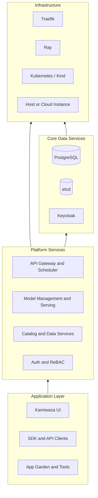

# Platform Architecture Overview

Kamiwaza is delivered as an application platform running on Kubernetes. The packaged RHEL deployment uses Kind and Podman for the single-node control plane, with Traefik providing ingress and Keycloak providing identity services.

## Architecture Layers

## What Each Layer Does

### Application layer

- **Kamiwaza UI** for operators and end users
- **SDK and API clients** for automation and integration
- **App Garden and tools** for deploying runtime applications through the platform

### Platform services

- **API gateway and scheduler** coordinate requests and platform workflows
- **model services** manage downloads, deployment, and inference
- **catalog and data services** support metadata, retrieval, and related workflows
- **security services** enforce login, role mapping, and resource authorization

### Core data services

- **PostgreSQL** stores application and service data
- **etcd** provides internal distributed configuration and coordination support
- **Keycloak** manages identity, authentication, and federation

### Infrastructure

- **Traefik** publishes the platform and runtime routes
- **Ray** powers distributed model-serving workflows
- **Kubernetes / Kind** provides orchestration for the packaged single-node deployment
- **host or cloud instance** supplies CPU, memory, storage, and optional GPU resources

## Packaged Production Footprint

For the supported RHEL install path, Kamiwaza expects:

- a pre-provisioned RHEL 9 server or EC2 instance
- the packaged RPM and, for offline installs, the signed wrap bundle
- platform access through the domain supplied to `install-prod.sh --domain`

## Related Guides

- [System Requirements](../installation/system_requirements.md)
- [Red Hat Offline Installation Guide](../installation/redhat_offline_install.md)
