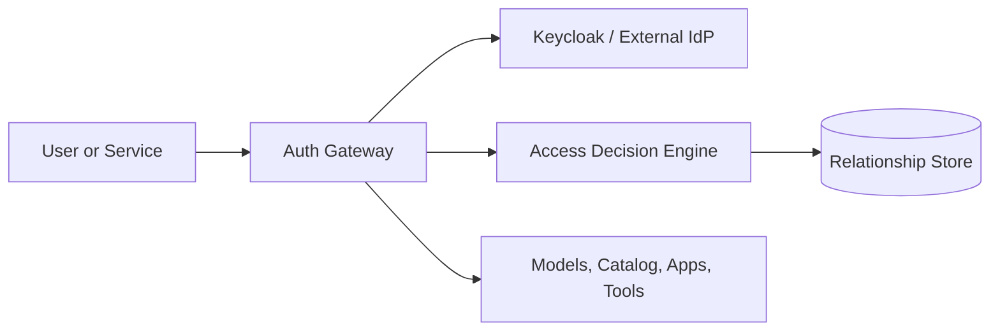

# Relationship-Based Access Control Overview

Kamiwaza uses relationship-based access control (ReBAC) to add resource-level authorization on top of normal user roles. Realm roles answer "what kind of user is this?", while ReBAC answers "what is this user allowed to do with this specific model, dataset, app, or other resource?"

## What ReBAC Adds

- deny-by-default authorization for protected resources
- resource-level access decisions in addition to role-based login
- tenant-aware access controls for environments that need isolation between organizations or missions
- decision logging that lets operators review allow and deny outcomes
- automatic ownership behavior for common create-and-manage workflows

## Architecture

### Main components

- **Identity provider**: Keycloak is the reference identity provider in the packaged deployment.
- **Auth gateway**: validates identity, applies route-level policy, and forwards identity context.
- **Access decision engine**: evaluates relationship checks for protected resources.
- **Relationship store**: persists the data used to answer resource-level authorization requests.

## Roles vs ReBAC

Use both together:

- **Realm roles** such as `admin`, `user`, and `viewer` define broad access patterns.
- **ReBAC relationships** define ownership or allowed actions for a specific resource.

Example:

- a `viewer` can browse data they are allowed to see
- an `admin` can manage platform-wide settings
- a user may still be denied access to a specific model or dataset if they do not hold the required relationship for that object

## Packaged Deployment Model

For the packaged RHEL install, operators enable and manage ReBAC through:

- `/opt/kamiwaza/cluster/values/overrides.yaml`
- `helmfile -e release sync`
- Keycloak role and claim mapping

The public deployment flow is covered in the [ReBAC Deployment Guide](./rebac-deployment-guide.md).

## Operational Expectations

- enable ReBAC only after the identity-provider roles and tenant behavior are understood
- validate both read and write paths with real test accounts
- review scheduler logs for `rebac` decision entries during rollout
- document any tenant fallback used in pilot environments and remove it before strict production enforcement

## Where ReBAC Matters Most

ReBAC is most useful when you need to:

- separate access between teams or tenants
- allow read access but restrict modifications
- enforce ownership of models, datasets, or runtime artifacts
- produce auditable evidence that a denied action was blocked for the right reason

## Next Steps

- [ReBAC Deployment Guide](./rebac-deployment-guide.md)
- [ReBAC Validation Checklist](./rebac-validation-checklist.md)
- [Administrator Guide](./admin-guide.md)
