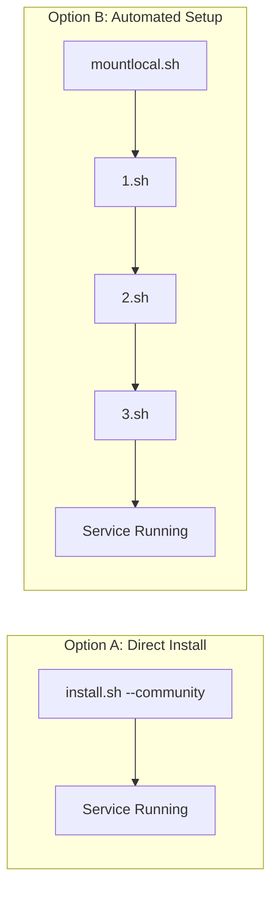
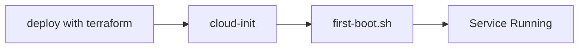
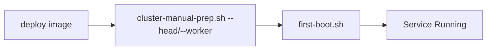

# Installing Kamiwaza

## Overview

Kamiwaza can be installed in several configurations:
- **Ubuntu .deb Package** (Recommended for Ubuntu 22.04)
- Community Edition on OSX (single-node)
- Community Edition on Linux (single-node)
- Enterprise Edition (cluster-capable)

## Before You Begin

**Please review the [System Requirements](system_requirements.md) before proceeding with installation.** This document covers:
- Supported operating systems and versions
- Hardware requirements (CPU, RAM, storage)
- Required system packages and dependencies
- Network and storage configuration
- GPU support requirements

## Installation Workflows

### 1. Ubuntu .deb Package Installation (Recommended)

For Ubuntu 22.04 or 24.04 users, the simplest installation method is using the official .deb package:

**Steps:**
1. Download the Kamiwaza .deb package from the official repository
2. Install using: `sudo dpkg -i kamiwaza-*.deb`
3. Resolve any dependencies: `sudo apt-get install -f`
4. The service will start automatically

**Benefits:**
- Automated dependency resolution
- System integration via package management
- Simplified updates and removal
- No manual configuration required

For detailed instructions, see the [Installing Kamiwaza PDF guide](../Installing%20Kamiwaza.pdf).

### 2. Community Edition on OSX

Simple, single-command installation:

### 3. Community Edition on Linux

Two options available:

Note: `mountlocal.sh` is only needed for Azure deployments requiring specific disk configurations.
The automated setup sequence (1.sh -> 2.sh -> 3.sh) can be used on any Linux system, but is primarily tested on Azure.

### 4. Enterprise Edition

#### A. Terraform Deployment (Recommended)

Key Points:
- Terraform handles complete cluster setup
- cloud-init automatically runs first-boot.sh
- Service starts automatically via systemd

#### B. Manual Cluster Deployment

Key Points:
- Requires manual cluster setup via cluster-manual-prep.sh
- Must specify correct role (`--head` or `--worker --head-ip=<IP>`)
- Service starts automatically via systemd

## Installation Method Selection

| Method | Best For | Complexity | Features |
|--------|----------|------------|----------|
| **Ubuntu .deb Package** | Ubuntu 22.04 users | ⭐ | Community Edition, automated setup |
| Community Edition (OSX) | macOS developers | ⭐⭐ | Single-node, local development |
| Community Edition (Linux) | Linux users, custom setups | ⭐⭐⭐ | Single-node, manual control |
| Enterprise Edition | Production clusters | ⭐⭐⭐⭐ | Multi-node, full features |

## Important Notes

1. **Ubuntu .deb Package:**
   - Simplest installation method for Ubuntu 22.04
   - Automated dependency management
   - System service integration

2. Community Edition:
   - OSX: Simple install.sh --community command
   - Linux: Choose between direct install or automated setup sequence
   - Automated setup (1.sh -> 2.sh -> 3.sh) handles prerequisites and NVIDIA container testing

3. Enterprise Edition:
   - Terraform method provides fully automated deployment
   - Manual method requires explicit cluster role specification
   - Both methods result in automatically running services

4. Service Management:
   - first-boot.sh configures and starts the service via systemd
   - No need to manually run startup scripts