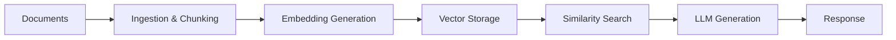

# Building a RAG Pipeline

Retrieval-Augmented Generation (RAG) combines the power of large language models with your own documents and data to provide accurate, contextual responses. This guide walks you through building a complete RAG pipeline using Kamiwaza's core services.

## What You'll Build

By the end of this guide, you'll have:
- **Document ingestion system** that processes various file formats
- **Embedding pipeline** that converts text to vector representations
- **Vector search system** for finding relevant context
- **LLM integration** that generates responses using retrieved context
- **Web interface** for querying your documents

## Prerequisites

Before starting, ensure you have:
- Kamiwaza installed and running ([Installation Guide](../installation/installation_process))
- At least 8GB of available RAM
- Sample documents (PDFs, text files, etc.) to process
- Basic familiarity with Python (for SDK examples)

## Architecture Overview

A RAG pipeline consists of four main components:



## Step 1: Deploy Required Models

First, we'll deploy an embedding model for vectorizing text and a language model for generating responses.

### Deploy an Embedding Model

1. Navigate to the **Models** section in Kamiwaza
2. Search for `sentence-transformers/all-MiniLM-L6-v2`
3. Download and deploy the model

Or use the API:

```python
import requests

# Deploy embedding model
requests.post('http://localhost:7777/api/models/sentence-transformers/all-MiniLM-L6-v2/deploy', json={
    'engine': 'transformers',
    'config': {
        'task': 'feature-extraction'
    }
})
```

### Deploy a Language Model

1. Search for and deploy `Qwen/Qwen2.5-0.5B-Instruct-GGUF`
2. Select the `Qwen2.5-0.5B-Instruct-Q6_K.gguf` file for CPU inference

```python
# Deploy chat model
requests.post('http://localhost:7777/api/models/Qwen/Qwen2.5-0.5B-Instruct-GGUF/deploy', json={
    'engine': 'llamacpp',
    'config': {
        'gpu_layers': 0,  # CPU inference
        'context_size': 4096
    }
})
```

## Step 2: Set Up Vector Storage

Create a vector collection to store document embeddings.

### Using the API

```python
import requests

# Create vector collection
collection_config = {
    "name": "documents",
    "dimension": 384,  # all-MiniLM-L6-v2 output dimension
    "metric_type": "COSINE",
    "index_type": "IVF_FLAT",
    "metadata_schema": {
        "title": "string",
        "source": "string",
        "chunk_id": "string",
        "page": "integer"
    }
}

response = requests.post(
    'http://localhost:7777/api/vectordb/collections',
    json=collection_config
)
```

### Using the Kamiwaza SDK

```python
from kamiwaza_sdk import KamiwazaClient

client = KamiwazaClient(base_url="http://localhost:7777")

# Create collection
client.vectordb.create_collection(
    name="documents",
    dimension=384,
    metric_type="COSINE",
    metadata_schema={
        "title": "str",
        "source": "str", 
        "chunk_id": "str",
        "page": "int"
    }
)
```

## Step 3: Document Ingestion Pipeline

Now we'll create a pipeline to process documents, chunk them, and generate embeddings.

### Document Processing Script

```python
import os
import requests
from pathlib import Path
from typing import List, Dict
import PyPDF2
import numpy as np

class RAGPipeline:
    def __init__(self, base_url="http://localhost:7777"):
        self.base_url = base_url
        self.embedding_model = "sentence-transformers/all-MiniLM-L6-v2"
        self.chat_model = "Qwen/Qwen2.5-0.5B-Instruct-GGUF"
        
    def extract_text_from_pdf(self, pdf_path: str) -> List[Dict]:
        """Extract text from PDF and return chunks with metadata."""
        chunks = []
        
        with open(pdf_path, 'rb') as file:
            pdf_reader = PyPDF2.PdfReader(file)
            
            for page_num, page in enumerate(pdf_reader.pages):
                text = page.extract_text()
                # Simple chunking - split by paragraphs
                paragraphs = [p.strip() for p in text.split('\n\n') if p.strip()]
                
                for chunk_id, paragraph in enumerate(paragraphs):
                    if len(paragraph) > 100:  # Filter out very short chunks
                        chunks.append({
                            'text': paragraph,
                            'metadata': {
                                'title': Path(pdf_path).stem,
                                'source': pdf_path,
                                'page': page_num + 1,
                                'chunk_id': f"{page_num}_{chunk_id}"
                            }
                        })
        
        return chunks
    
    def generate_embeddings(self, texts: List[str]) -> List[List[float]]:
        """Generate embeddings for a list of texts."""
        response = requests.post(
            f'{self.base_url}/api/models/{self.embedding_model}/embeddings',
            json={'input': texts}
        )
        
        if response.status_code == 200:
            return response.json()['data']
        else:
            raise Exception(f"Embedding generation failed: {response.text}")
    
    def store_vectors(self, chunks: List[Dict], embeddings: List[List[float]]):
        """Store text chunks and their embeddings in the vector database."""
        vectors_data = {
            "vectors": [
                {
                    "id": f"{chunk['metadata']['source']}_{chunk['metadata']['chunk_id']}",
                    "vector": embedding,
                    "metadata": {
                        **chunk['metadata'],
                        "text": chunk['text']
                    }
                }
                for chunk, embedding in zip(chunks, embeddings)
            ]
        }
        
        response = requests.post(
            f'{self.base_url}/api/vectordb/collections/documents/insert',
            json=vectors_data
        )
        
        if response.status_code != 200:
            raise Exception(f"Vector storage failed: {response.text}")
    
    def process_document(self, document_path: str):
        """Complete pipeline to process a single document."""
        print(f"Processing: {document_path}")
        
        # Extract text chunks
        chunks = self.extract_text_from_pdf(document_path)
        print(f"Extracted {len(chunks)} chunks")
        
        # Generate embeddings
        texts = [chunk['text'] for chunk in chunks]
        embeddings = self.generate_embeddings(texts)
        print(f"Generated {len(embeddings)} embeddings")
        
        # Store in vector database
        self.store_vectors(chunks, embeddings)
        print("Stored vectors successfully")

# Usage
pipeline = RAGPipeline()

# Process all PDFs in a directory
docs_directory = "path/to/your/documents"
for pdf_file in Path(docs_directory).glob("*.pdf"):
    pipeline.process_document(str(pdf_file))
```

## Step 4: Implement Retrieval and Generation

Now we'll create the query interface that retrieves relevant documents and generates responses.

```python
class RAGQuery:
    def __init__(self, base_url="http://localhost:7777"):
        self.base_url = base_url
        self.embedding_model = "sentence-transformers/all-MiniLM-L6-v2"
        self.chat_model = "Qwen/Qwen2.5-0.5B-Instruct-GGUF"
    
    def embed_query(self, query: str) -> List[float]:
        """Generate embedding for the user query."""
        response = requests.post(
            f'{self.base_url}/api/models/{self.embedding_model}/embeddings',
            json={'input': [query]}
        )
        
        if response.status_code == 200:
            return response.json()['data'][0]
        else:
            raise Exception(f"Query embedding failed: {response.text}")
    
    def retrieve_context(self, query_embedding: List[float], top_k: int = 5) -> List[Dict]:
        """Retrieve relevant document chunks."""
        search_request = {
            "vector": query_embedding,
            "top_k": top_k,
            "include_metadata": True
        }
        
        response = requests.post(
            f'{self.base_url}/api/vectordb/collections/documents/search',
            json=search_request
        )
        
        if response.status_code == 200:
            return response.json()['results']
        else:
            raise Exception(f"Vector search failed: {response.text}")
    
    def generate_response(self, query: str, context_chunks: List[Dict]) -> str:
        """Generate response using retrieved context."""
        # Prepare context from retrieved chunks
        context = "\n\n".join([
            f"Document: {chunk['metadata']['title']} (Page {chunk['metadata']['page']})\n{chunk['metadata']['text']}"
            for chunk in context_chunks
        ])
        
        # Create prompt with context
        prompt = f"""Based on the following context, answer the user's question. If the context doesn't contain enough information to answer the question, say so.

Context:
{context}

Question: {query}

Answer:"""
        
        # Generate response
        response = requests.post(
            f'{self.base_url}/api/models/{self.chat_model}/chat',
            json={
                'messages': [
                    {'role': 'user', 'content': prompt}
                ],
                'max_tokens': 500,
                'temperature': 0.7
            }
        )
        
        if response.status_code == 200:
            return response.json()['choices'][0]['message']['content']
        else:
            raise Exception(f"Response generation failed: {response.text}")
    
    def query(self, user_question: str) -> Dict:
        """Complete RAG query pipeline."""
        print(f"Processing query: {user_question}")
        
        # Generate query embedding
        query_embedding = self.embed_query(user_question)
        
        # Retrieve relevant context
        context_chunks = self.retrieve_context(query_embedding)
        
        # Generate response
        response = self.generate_response(user_question, context_chunks)
        
        return {
            'question': user_question,
            'answer': response,
            'sources': [
                {
                    'title': chunk['metadata']['title'],
                    'page': chunk['metadata']['page'],
                    'score': chunk['score']
                }
                for chunk in context_chunks
            ]
        }

# Usage
rag = RAGQuery()

# Query your documents
result = rag.query("What are the main benefits of artificial intelligence?")
print(f"Answer: {result['answer']}")
print(f"Sources: {result['sources']}")
```

## Step 5: Create a Simple Web Interface

Let's create a basic web interface using Streamlit to interact with your RAG system.

```python
import streamlit as st
import requests
from rag_pipeline import RAGQuery  # Your RAG implementation

# Initialize RAG system
@st.cache_resource
def init_rag():
    return RAGQuery()

st.title("📚 Document Q&A with RAG")
st.write("Ask questions about your uploaded documents!")

# Initialize RAG
rag = init_rag()

# Query interface
user_question = st.text_input("Ask a question about your documents:")

if user_question:
    with st.spinner("Searching documents and generating answer..."):
        try:
            result = rag.query(user_question)
            
            # Display answer
            st.success("Answer:")
            st.write(result['answer'])
            
            # Display sources
            st.subheader("📖 Sources:")
            for source in result['sources']:
                st.write(f"- **{source['title']}** (Page {source['page']}) - Relevance: {source['score']:.3f}")
                
        except Exception as e:
            st.error(f"Error: {e}")

# Sidebar for system status
st.sidebar.header("System Status")
try:
    # Check if models are deployed
    models_response = requests.get('http://localhost:7777/api/models')
    if models_response.status_code == 200:
        st.sidebar.success("✅ Models service online")
    else:
        st.sidebar.error("❌ Models service offline")
        
    # Check vector database
    vectordb_response = requests.get('http://localhost:7777/api/vectordb/status')
    if vectordb_response.status_code == 200:
        st.sidebar.success("✅ Vector database online")
    else:
        st.sidebar.error("❌ Vector database offline")
        
except Exception as e:
    st.sidebar.error(f"❌ System check failed: {e}")
```

Run the interface with:
```bash
streamlit run rag_interface.py
```

## Step 6: Deploy as an App Garden Application

For production use, you can package your RAG system as an App Garden application.

### Create docker-compose.yml

```yaml
version: '3.8'

services:
  rag-app:
    build: .
    ports:
      - "8501:8501"
    environment:
      - KAMIWAZA_BASE_URL=http://host.docker.internal:7777
    volumes:
      - ./documents:/app/documents
    depends_on:
      - kamiwaza

  kamiwaza:
    external: true
```

### Create Dockerfile

```dockerfile
FROM python:3.10-slim

WORKDIR /app

COPY requirements.txt .
RUN pip install -r requirements.txt

COPY . .

EXPOSE 8501

CMD ["streamlit", "run", "rag_interface.py", "--server.address", "0.0.0.0"]
```

## Best Practices

### Document Processing
- **Chunk Size**: Keep chunks between 200-800 tokens for optimal retrieval
- **Overlap**: Add 50-100 token overlap between chunks to preserve context
- **Metadata**: Include rich metadata (source, date, author) for filtering
- **Preprocessing**: Clean text, remove headers/footers, handle special characters

### Vector Search Optimization
- **Index Tuning**: Adjust index parameters based on collection size
- **Reranking**: Use a reranking model for better result quality
- **Hybrid Search**: Combine vector search with keyword matching
- **Filtering**: Use metadata filters to narrow search scope

### LLM Integration
- **Context Window**: Stay within model's context limits
- **Prompt Engineering**: Design clear, specific system prompts
- **Temperature**: Use lower values (0.1-0.3) for factual responses
- **Citations**: Always include source attribution in responses

## Monitoring and Maintenance

### Performance Monitoring
```python
# Add timing and logging to your pipeline
import time
import logging

logging.basicConfig(level=logging.INFO)
logger = logging.getLogger(__name__)

def query_with_monitoring(self, query: str):
    start_time = time.time()
    
    # Your query logic here
    result = self.query(query)
    
    elapsed_time = time.time() - start_time
    logger.info(f"Query processed in {elapsed_time:.2f}s")
    
    return result
```

### Regular Updates
- **Refresh Embeddings**: Reprocess documents when updating embedding models
- **Index Optimization**: Rebuild vector indices periodically
- **Model Updates**: Test and deploy newer, better models
- **Content Updates**: Set up automated document ingestion for new content

## Troubleshooting

### Common Issues

**Poor Retrieval Quality**
- Check embedding model performance on your domain
- Adjust chunk size and overlap
- Try different similarity metrics (cosine vs. dot product)
- Consider domain-specific fine-tuning

**Slow Query Performance**
- Optimize vector index parameters
- Reduce `top_k` in retrieval
- Use GPU acceleration for embeddings
- Implement result caching

**Inaccurate Responses**
- Improve prompt engineering
- Increase retrieved context size
- Use a larger/better language model
- Add response validation logic

## Next Steps

Now that you have a working RAG pipeline:

- Learn about advanced search techniques in the [Distributed Data Engine](../data-engine)
- Explore prompt optimization patterns for better responses
- Set up monitoring and analytics for your system performance
- Scale your system using Kamiwaza's [distributed architecture](../architecture/overview)

Your RAG pipeline is now ready to answer questions using your own documents! Experiment with different models, chunk sizes, and retrieval strategies to optimize for your specific use case. 