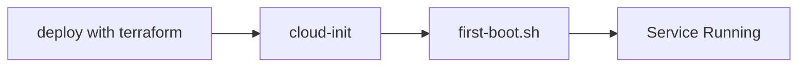
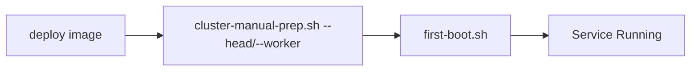

# Installing Kamiwaza

## Before You Begin

**Please review the [System Requirements](system_requirements.md) before proceeding with installation.** This document covers:
- Supported operating systems and versions
- Hardware requirements (CPU, RAM, storage)
- Required system packages and dependencies
- Network and storage configuration
- GPU support requirements

## Installation Workflows

### Linux

#### Ubuntu .deb Package Installation (for Ubuntu 24.04 Noble)

1. Add Kamiwaza repository to APT sources
   ```
   echo "deb [signed-by=/usr/share/keyrings/kamiwaza-archive-keyring.gpg] https://packages.kamiwaza.ai/ubuntu/ noble main" | sudo tee /etc/apt/sources.list.d/kamiwaza.list
   ```
2. Import and install Kamiwaza GPG signing key
   ```
   curl -fsSL https://packages.kamiwaza.ai/gpg | sudo gpg --dearmor -o /usr/share/keyrings/kamiwaza-archive-keyring.gpg
   ```
2. Update package database and install Kamiwaza
   ```
   sudo apt update
   sudo apt upgrade
   sudo apt install kamiwaza
   ```
3. Verify service starts (see [Quickstart](quickstart.md))

#### Other Linux Distros via Tarball

1. Follow the consolidated guide: [Linux/macOS tarball installation](linux_macos_tarball.md)
2. Ensure Docker Engine (with Compose v2), Python 3.10, and Node.js 22 are available (installer may configure as needed)
3. Run `install.sh --community`
4. Access via browser at `https://localhost`


### Community Edition on macOS

_Only Community Edition is supported on macOS._

1. Follow the consolidated guide: [Linux/macOS tarball installation](linux_macos_tarball.md)
2. Ensure Docker Engine (with Compose v2), Python 3.10, and Node.js 22 are available (installer may configure as needed)
3. Run `install.sh --community`
4. Access via browser at `https://localhost`

### Community Edition on Windows

Use the MSI installer for a streamlined WSL2-based setup. See the [Windows Installation Guide](windows_installation_guide.md) for prerequisites, GPU support, and step-by-step instructions.

Steps:
1. Download: `KamiwazaInstaller-[version]-[arch].msi`
2. Install: Run the MSI (reboot when prompted)
3. Launch: Start Menu → "Kamiwaza Start"


### Enterprise Edition Deployment

#### A. Terraform Deployment (Recommended)



Key Points:
- Terraform handles complete cluster setup
- cloud-init automatically runs first-boot.sh
- Service starts automatically via systemd

#### B. Manual Cluster Deployment



Key Points:
- Requires manual cluster setup via cluster-manual-prep.sh
- Must specify correct role (`--head` or `--worker --head-ip=<IP>`)
- Service starts automatically via systemd


## Updating Kamiwaza

### Windows
- Download new MSI installer and run to update existing installation
- Restart if prompted for GPU changes

### Linux/macOS
- Download new package
- Run installation script again
- Service will restart automatically

## Uninstallation

### Windows
- Windows Settings → Add or Remove Programs -> (three dots on side) Uninstall

### Linux/macOS
- Remove package via package manager
- Clean up any remaining configuration files
