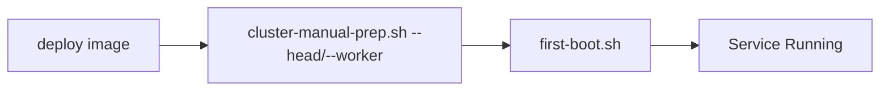

# Installing Kamiwaza

## Before You Begin

**Please review the [System Requirements](system_requirements.md) before proceeding with installation.** This document covers:
- Supported operating systems and versions
- Hardware requirements (CPU, RAM, storage)
- Required system packages and dependencies
- Network and storage configuration
- GPU support requirements

## Installation Workflows

### Linux

#### Ubuntu .deb Package Installation

Download the appropriate package for your Ubuntu version and architecture:

| Ubuntu Version | Architecture | Download |
|---------------|--------------|----------|
| 24.04 (Noble) | x86_64 | [kamiwaza_v0.9.3_noble_x86_64.deb](https://packages.kamiwaza.ai/deb/kamiwaza_v0.9.3_noble_x86_64.deb) |
| 24.04 (Noble) | ARM64 | [kamiwaza_v0.9.3_noble_arm64.deb](https://packages.kamiwaza.ai/deb/kamiwaza_v0.9.3_noble_arm64.deb) |
| 24.04 (Noble) | ARM64 (DGX Spark) | [kamiwaza_v0.9.3_noble_arm64_dgx.deb](https://packages.kamiwaza.ai/deb/kamiwaza_v0.9.3_noble_arm64_dgx.deb) |
| 22.04 (Jammy) | x86_64 | [kamiwaza_v0.9.3_jammy_x86_64.deb](https://packages.kamiwaza.ai/deb/kamiwaza_v0.9.3_jammy_x86_64.deb) |
| 22.04 (Jammy) | ARM64 | [kamiwaza_v0.9.3_jammy_ARM64.deb](https://packages.kamiwaza.ai/deb/kamiwaza_v0.9.3_jammy_ARM64.deb) |

**ARM64 Package Selection:**
- **ARM64** - For generic ARM64 systems (AWS Graviton, Ampere Altra, etc.)
- **ARM64 (DGX Spark)** - For NVIDIA DGX Spark with Grace Blackwell CPU (includes CUDA-ARM dependencies)

Install using dpkg:
```bash
# Download the package (example for Ubuntu 24.04 x86_64)
curl -LO https://packages.kamiwaza.ai/deb/kamiwaza_v0.9.3_noble_x86_64.deb

# Install the package
sudo dpkg -i kamiwaza_v0.9.3_noble_x86_64.deb

# Install any missing dependencies
sudo apt-get install -f
```

Verify service starts (see [Quickstart](../quickstart.md))

#### RHEL .rpm Package Installation (for RHEL 9)

Download and install the RPM package:

```bash
# Download the package
curl -LO https://packages.kamiwaza.ai/rpm/kamiwaza_v0.9.3_rhel9_x86_64.rpm

# Install the package
sudo dnf install ./kamiwaza_v0.9.3_rhel9_x86_64.rpm
```

For air-gapped or offline RHEL environments, see the [Red Hat Offline Installation Guide](redhat_offline_install.md).

### Community Edition on macOS

_Only Community Edition is supported on macOS._

1. Follow the guide: [macOS tarball installation](macos_tarball.md)
2. Ensure Docker Desktop is installed and running
3. Run `install.sh --community`
4. Access via browser at `https://localhost`

### Community Edition on Windows

Use the MSI installer for a streamlined WSL2-based setup. See the [Windows Installation Guide](windows_installation_guide.md) for prerequisites, GPU support, and step-by-step instructions.

Steps:
1. Download: `KamiwazaInstaller-[version]-[arch].msi`
2. Install: Run the MSI (reboot when prompted)
3. Launch: Start Menu → "Kamiwaza Start"


### Enterprise Edition Deployment

#### A. Terraform Deployment (Recommended)


Key Points:
- Terraform handles complete cluster setup
- cloud-init automatically runs first-boot.sh
- Service starts automatically via systemd

#### B. Manual Cluster Deployment



Key Points:
- Requires manual cluster setup via cluster-manual-prep.sh
- Must specify correct role (`--head` or `--worker --head-ip=<IP>`)
- Service starts automatically via systemd


## Updating Kamiwaza

### Windows
- Download new MSI installer and run to update existing installation
- Restart if prompted for GPU changes

### Linux/macOS
- Download new package
- Run installation script again
- Service will restart automatically

## Uninstallation

### Windows
- Windows Settings → Add or Remove Programs -> (three dots on side) Uninstall

### Linux/macOS
- Remove package via package manager
- Clean up any remaining configuration files
